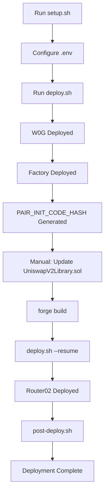

# Uniswap V2 Fork for 0G Aristotle Mainnet

Complete Uniswap V2 deployment (W0G + Factory + Router02) for **0G Aristotle Mainnet** to unblock Pi Forge Quantum Genesis launch.

## Network Details

- **Chain ID**: 16661
- **RPC URL**: https://evmrpc.0g.ai
- **Block Explorer**: https://chainscan.0g.ai
- **Native Token**: 0G (A0GI)
- **Launch Date**: September 22, 2025

## Quick Start

### 1. Prerequisites

- [Foundry](https://book.getfoundry.sh/getting-started/installation) installed
- Funded wallet with at least 0.5 0G
- Git for submodule management

```bash
# Install Foundry
curl -L https://foundry.paradigm.xyz | bash
foundryup
```

### 2. Setup Project

```bash
cd contracts/0g-uniswap-v2
./scripts/setup.sh
```

This will:
- Install forge-std, OpenZeppelin, and Uniswap V2 dependencies
- Build all contracts
- Create `.env` from template

### 3. Configure Environment

Edit `.env` with your deployment credentials:

```bash
PRIVATE_KEY=your_private_key_here
DEPLOYER=your_wallet_address
FEE_TO_SETTER=your_wallet_address  # Use multisig for production
RPC_URL=https://evmrpc.0g.ai
CHAIN_ID=16661
```

⚠️ **SECURITY**: Never commit your `.env` file!

### 4. Deploy Contracts

```bash
./scripts/deploy.sh
```

This performs:
- Pre-flight safety checks (balance, RPC connectivity)
- W0G deployment
- UniswapV2Factory deployment
- PAIR_INIT_CODE_HASH computation
- Contract verification on Chainscan (optional)

### 5. Update Init Code Hash

After factory deployment:

1. Copy `PAIR_INIT_CODE_HASH` from deployment logs
2. Update `lib/v2-periphery/contracts/libraries/UniswapV2Library.sol`:
   ```solidity
   hex'<YOUR_PAIR_INIT_CODE_HASH_HERE>' // Replace this
   ```
3. Rebuild contracts:
   ```bash
   forge build
   ```

### 6. Deploy Router

```bash
./scripts/deploy.sh --resume
```

### 7. Post-Deployment Validation

```bash
./scripts/post-deploy.sh
```

This generates a comprehensive deployment report with all contract addresses.

## Project Structure

```
0g-uniswap-v2/
├── src/
│   └── W0G.sol                 # Wrapped 0G (WETH9 standard)
├── script/
│   └── Deploy.s.sol            # Deployment script
├── test/
│   └── ZeroGDeployment.t.sol   # Comprehensive test suite
├── scripts/
│   ├── setup.sh                # Project initialization
│   ├── deploy.sh               # Deployment automation
│   └── post-deploy.sh          # Post-deployment validation
├── lib/                        # Git submodules (Uniswap v2)
├── artifacts/                  # Deployment reports
├── foundry.toml                # Foundry configuration
├── .env.example                # Environment template
└── README.md                   # This file
```

## Deployment Workflow



## Contract Addresses

After deployment, save addresses to `.env.launch`:

```bash
ZERO_G_W0G=0x...
ZERO_G_FACTORY=0x...
ZERO_G_UNIVERSAL_ROUTER=0x...
ZERO_G_RPC=https://evmrpc.0g.ai
```

## Testing

### Run All Tests

```bash
forge test -vvv
```

### Run Specific Test

```bash
forge test --match-test testW0GDeposit -vvv
```

### Run with Gas Report

```bash
forge test --gas-report
```

### Test Coverage

The test suite includes:
- ✅ W0G deposit/withdrawal
- ✅ W0G transfer functionality
- ✅ W0G approval mechanism
- ✅ Edge cases (zero amounts, self-transfers)
- ✅ Fuzz tests for various amounts
- ✅ Gas optimization tracking

Future tests (after full deployment):
- Pair creation
- Liquidity addition/removal
- Swap execution
- Router edge cases

## Integration with Pi Forge

### 1. Update Root Environment

Add to `/home/runner/work/pi-forge-quantum-genesis/pi-forge-quantum-genesis/.env`:

```bash
# 0G Aristotle Mainnet - Uniswap V2 Integration
ZERO_G_W0G=0x...
ZERO_G_FACTORY=0x...
ZERO_G_UNIVERSAL_ROUTER=0x...
ZERO_G_RPC=https://evmrpc.0g.ai
ZERO_G_CHAIN_ID=16661
```

### 2. Backend Configuration

Create `server/config.py`:

```python
# 0G Aristotle Network Configuration
ZERO_G_CONFIG = {
    "chain_id": 16661,
    "rpc_url": os.getenv("ZERO_G_RPC", "https://evmrpc.0g.ai"),
    "router_address": os.getenv("ZERO_G_UNIVERSAL_ROUTER"),
    "factory_address": os.getenv("ZERO_G_FACTORY"),
    "w0g_address": os.getenv("ZERO_G_W0G"),
    "block_explorer": "https://chainscan.0g.ai"
}
```

### 3. Create Integration Module

See `server/integrations/zero_g_swap.py` for swap functionality.

### 4. Frontend Integration

```javascript
// Example: Execute swap via router
const router = new ethers.Contract(
  ZERO_G_UNIVERSAL_ROUTER,
  UniswapV2Router02ABI,
  signer
);

const tx = await router.swapExactTokensForTokens(
  amountIn,
  amountOutMin,
  [tokenA, tokenB],
  recipient,
  deadline
);
```

## Safety Features

### Pre-Deployment Checks
- ✅ Minimum balance verification (0.5 0G)
- ✅ RPC connectivity test
- ✅ Chain ID validation
- ✅ Gas price monitoring

### Post-Deployment Validation
- ✅ Contract code verification
- ✅ W0G name/symbol check
- ✅ Factory functionality test
- ✅ Router connectivity test

### Security Recommendations

1. **Private Key Management**
   - Use hardware wallet for production
   - Never commit private keys to version control
   - Rotate keys after initial setup

2. **Fee Recipient (feeToSetter)**
   - Start with deployer address for testing
   - Migrate to Gnosis Safe multisig for production
   - Document multisig ownership structure

3. **Monitoring**
   - Set up alerts for unusual swap activity
   - Monitor liquidity pool changes
   - Track gas price fluctuations

4. **Emergency Procedures**
   - Document pause mechanisms
   - Establish incident response plan
   - Maintain backup RPC endpoints

## Troubleshooting

### Build Failures

```bash
# Clean and rebuild
forge clean
forge build
```

### Submodule Issues

```bash
# Reinitialize submodules
git submodule update --init --recursive
```

### RPC Connection Errors

```bash
# Test RPC connectivity
curl -X POST https://evmrpc.0g.ai \
  -H "Content-Type: application/json" \
  -d '{"jsonrpc":"2.0","method":"eth_chainId","params":[],"id":1}'

# Expected response: {"jsonrpc":"2.0","id":1,"result":"0x4115"}
```

### Insufficient Gas

- Increase deployer wallet balance
- Check gas price with: `cast gas-price --rpc-url https://evmrpc.0g.ai`

### Verification Failures

Manual verification on Chainscan:
1. Navigate to contract address
2. Click "Verify & Publish"
3. Upload flattened source:
   ```bash
   forge flatten src/W0G.sol > W0G_flat.sol
   ```

## Post-Deployment Checklist

- [ ] All contracts deployed successfully
- [ ] Contract addresses saved to `.env.launch`
- [ ] Contracts verified on Chainscan
- [ ] W0G wrap/unwrap tested
- [ ] Test pair created
- [ ] Initial liquidity added
- [ ] Test swap executed
- [ ] Pi Forge `.env` updated
- [ ] Backend integration tested
- [ ] Frontend integration verified
- [ ] Monitoring alerts configured
- [ ] Documentation updated
- [ ] Team notified

## Gas Estimates

Approximate gas costs on 0G Aristotle:

| Operation | Gas Used | Est. Cost @ 10 gwei |
|-----------|----------|---------------------|
| W0G Deploy | ~650,000 | 0.0065 0G |
| Factory Deploy | ~2,500,000 | 0.025 0G |
| Router Deploy | ~3,500,000 | 0.035 0G |
| Create Pair | ~250,000 | 0.0025 0G |
| Add Liquidity | ~150,000 | 0.0015 0G |
| Swap | ~120,000 | 0.0012 0G |

**Total Deployment Cost**: ~0.067 0G + safety buffer = **0.1 0G recommended**

## Support & Resources

- **0G Documentation**: https://docs.0g.ai
- **Uniswap V2 Docs**: https://docs.uniswap.org/contracts/v2
- **Foundry Book**: https://book.getfoundry.sh
- **Block Explorer**: https://chainscan.0g.ai

## Contributing

This deployment is part of the Pi Forge Quantum Genesis project. For issues or improvements:

1. Fork the repository
2. Create a feature branch
3. Submit a pull request with detailed description

## License

MIT License - See LICENSE file for details

## Acknowledgments

- Built with [Foundry](https://github.com/foundry-rs/foundry)
- Based on [Uniswap V2](https://github.com/Uniswap/v2-core)
- Deployed on [0G Aristotle Mainnet](https://0g.ai)
- Part of [Pi Forge Quantum Genesis](https://github.com/onenoly1010/pi-forge-quantum-genesis)

---

**Status**: Ready for deployment to 0G Aristotle Mainnet (Chain ID 16661)

**Timeline**: ~2.5 hours for complete deployment and integration
