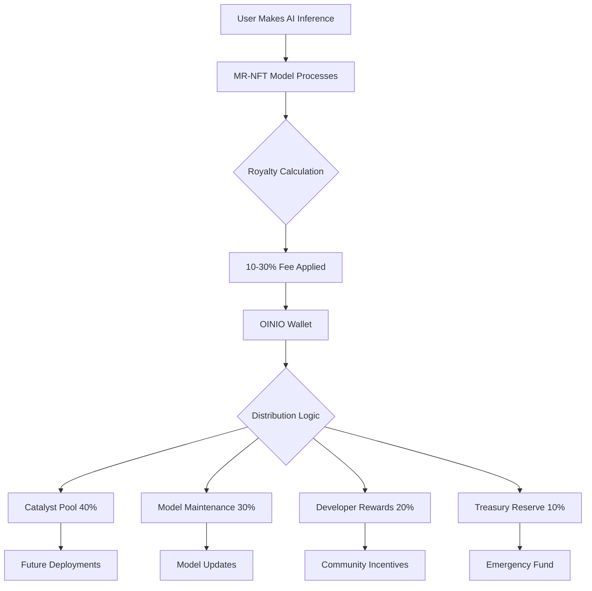
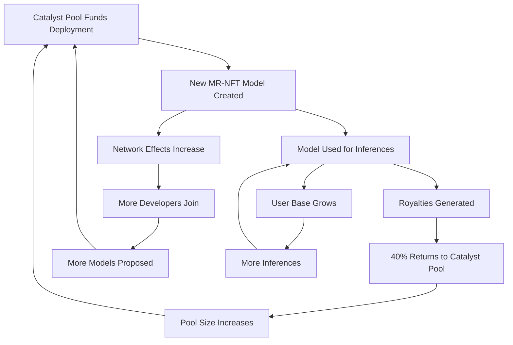
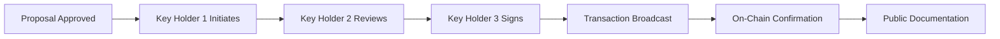

# 💰 Catalyst Pool Economics

**Pool Size**: 12,000,000 PI  
**Status**: ✅ **ACTIVE** (December 2025)  
**Governance**: OINIO DAO Multi-Sig

## Executive Summary

The Catalyst Pool is a 12M PI treasury that funds deployment of ethical AI models as MR-NFTs (Model Registry - Non-Fungible Tokens) on the Pi Network. Combined with 10-30% inference royalties, it creates a self-sustaining flywheel where each deployment strengthens the entire ecosystem.

**Key Economics:**
- **Initial Capital**: 12M PI locked in smart contract
- **Taper Schedule**: 8× → 1× multiplier over deployment cycles
- **Royalty Range**: 10-30% per inference
- **Flywheel Mechanism**: Royalties fund future deployments
- **Governance**: Community-controlled via OINIO DAO

---

## Pool Structure

### Total Allocation: 12,000,000 PI

The Catalyst Pool represents a significant capital commitment to ethical AI infrastructure:

**Funding Source**: Initial creator contribution at succession  
**Lock Mechanism**: Smart contract with multi-sig withdrawal controls  
**Purpose**: Fund deployment of MR-NFT models that generate royalties  
**Sustainability**: Royalty income replenishes pool over time

### Why 12 Million PI?

The 12M PI figure is calibrated to:

1. **Bootstrap 100+ Models**: At average 120K PI per deployment
2. **Maintain 8× Multiplier**: Early deployments need higher incentives
3. **Ensure Longevity**: Pool persists through taper schedule
4. **Enable Experimentation**: Sufficient capital for trial deployments

**Calculation:**
```
12M PI base pool
× 8 initial multiplier
= 96M PI effective capital (early phase)

96M PI / 120K per model
= 800 deployments at peak multiplier

Even at 1× multiplier (long-term):
12M PI / 120K per model
= 100 deployments
```

---

## Taper Schedule

### 8× → 1× Multiplier Decay

The taper schedule gradually reduces deployment incentives as the network effects strengthen:

| Deployment Cycle | Multiplier | Effective Pool | Models Funded | Rationale |
|-----------------|-----------|----------------|---------------|-----------|
| **1-10** | 8× | 96M PI | 800 models | Bootstrap phase - need maximum incentive |
| **11-25** | 6× | 72M PI | 600 models | Early growth - network effects emerging |
| **26-50** | 4× | 48M PI | 400 models | Scaling phase - community established |
| **51-100** | 2× | 24M PI | 200 models | Maturity - organic growth sufficient |
| **101+** | 1× | 12M PI | 100 models | Sustainable phase - self-funding via royalties |

### Why Taper?

**Economic Principles:**

1. **Diminishing Marginal Incentives**: Early adopters need higher incentives to take risks
2. **Network Effects**: Later deployments benefit from established ecosystem
3. **Sustainability**: Prevents pool depletion before royalty income stabilizes
4. **Fair Distribution**: Prevents late-stage exploitation of early-stage capital

**Taper Trigger Mechanisms:**

- **Deployment Count**: Automatic reduction every 10-50 deployments
- **Time-Based**: Fallback reduction every 6-12 months
- **Governance Override**: Community can accelerate/delay taper with 2/3 vote

### Taper Formula

```python
def calculate_multiplier(deployment_count):
    """
    Calculate current multiplier based on deployment count.
    """
    if deployment_count <= 10:
        return 8.0
    elif deployment_count <= 25:
        return 6.0
    elif deployment_count <= 50:
        return 4.0
    elif deployment_count <= 100:
        return 2.0
    else:
        return 1.0

def effective_pool_size(base_pool=12_000_000, deployment_count=0):
    """
    Calculate effective pool size with taper multiplier.
    """
    multiplier = calculate_multiplier(deployment_count)
    return base_pool * multiplier
```

---

## Royalty Structure

### 10-30% Inference Fees

Each MR-NFT model generates royalties from inference usage:

#### Royalty Tiers

| Model Complexity | Royalty Rate | Justification | Examples |
|-----------------|-------------|---------------|----------|
| **Simple** | 10% | Lightweight, fast inference | Transparency Scorer |
| **Standard** | 15% | Multi-dimensional analysis | Ethics Validator, Privacy Auditor |
| **Complex** | 20% | Advanced algorithms, large models | Bias Detector, Fairness Analyzer |
| **Premium** | 30% | Highest complexity, full tracing | Accountability Tracker |

#### Why Variable Royalties?

**Value Alignment:**
- More complex models require more development resources
- Higher accuracy/depth justifies higher fees
- Market competition keeps rates reasonable

**Economic Efficiency:**
- Simple models remain accessible
- Premium models fund their own maintenance
- Developers can choose appropriate tier

**Sustainability:**
- 10% ensures minimum viability
- 30% cap prevents exploitation
- Range accommodates diverse use cases

### The Six Seed Models

Initial deployments establish the royalty range:

```python
SEED_MODELS = {
    "Ethics Validator": {
        "royalty": 0.15,  # 15%
        "complexity": "Standard",
        "expected_usage": "High",
        "deployment_cost": 120_000  # PI
    },
    "Bias Detector": {
        "royalty": 0.20,  # 20%
        "complexity": "Complex",
        "expected_usage": "Very High",
        "deployment_cost": 150_000  # PI
    },
    "Privacy Auditor": {
        "royalty": 0.15,  # 15%
        "complexity": "Standard",
        "expected_usage": "High",
        "deployment_cost": 120_000  # PI
    },
    "Transparency Scorer": {
        "royalty": 0.10,  # 10%
        "complexity": "Simple",
        "expected_usage": "Very High",
        "deployment_cost": 80_000  # PI
    },
    "Fairness Analyzer": {
        "royalty": 0.20,  # 20%
        "complexity": "Complex",
        "expected_usage": "High",
        "deployment_cost": 150_000  # PI
    },
    "Accountability Tracker": {
        "royalty": 0.30,  # 30%
        "complexity": "Premium",
        "expected_usage": "Medium",
        "deployment_cost": 200_000  # PI
    }
}

total_deployment_cost = 820_000  # PI for all six models
```

---

## Distribution Rules

### How Funds Flow from MR-NFT Usage to Catalyst Pool



### Distribution Breakdown

From each royalty payment:

| Allocation | Percentage | Purpose | Example (1000 PI royalty) |
|-----------|-----------|---------|---------------------------|
| **Catalyst Pool** | 40% | Fund future model deployments | 400 PI |
| **Model Maintenance** | 30% | Updates, bug fixes, improvements | 300 PI |
| **Developer Rewards** | 20% | Community developer incentives | 200 PI |
| **Treasury Reserve** | 10% | Emergency fund, governance | 100 PI |

**Adjustable via Governance:**
- Community can vote to adjust distribution (2/3 majority)
- Changes take effect for future royalties only
- Historical allocations remain unchanged

### Royalty Flow Example

**Scenario:** Bias Detector model processes 10,000 inferences

```python
# Calculation
inferences = 10_000
cost_per_inference = 1.0  # PI
revenue = inferences * cost_per_inference  # 10,000 PI

royalty_rate = 0.20  # 20% for Bias Detector
royalty_amount = revenue * royalty_rate  # 2,000 PI

# Distribution
catalyst_pool = royalty_amount * 0.40  # 800 PI
model_maintenance = royalty_amount * 0.30  # 600 PI
developer_rewards = royalty_amount * 0.20  # 400 PI
treasury_reserve = royalty_amount * 0.10  # 200 PI

# Result
print(f"Catalyst Pool receives: {catalyst_pool} PI")
print(f"Available for next deployment at 8× multiplier: {catalyst_pool * 8} PI")
```

**Result**: Single model's day of usage can fund multiple new deployments during bootstrap phase.

---

## Address Routing

### Exact EVM/Pi Addresses for Payments

**Primary OINIO Wallet:**
```
Address: [To be added after succession execution]
Format: 0x[40 hexadecimal characters]
Network: Pi Network Mainnet
Type: Multi-Sig (3-of-5 or 5-of-9)
```

**Catalyst Pool Smart Contract:**
```
Address: [To be added after deployment]
Format: 0x[40 hexadecimal characters]
Network: Pi Network Mainnet
Type: Smart Contract
Source: [GitHub link to verified source]
```

**MR-NFT Factory Contract:**
```
Address: [To be added after deployment]
Format: 0x[40 hexadecimal characters]
Network: Pi Network Mainnet
Purpose: Deploy new MR-NFT models
```

### Smart Contract Integration

**Royalty Payment Flow:**

```solidity
// Simplified example - actual implementation may differ
contract MRNFTModel {
    address public oinioWallet = 0x[OINIO_ADDRESS];
    uint256 public royaltyRate = 15; // 15% in basis points (1500)
    
    function processInference(bytes memory input) public payable {
        require(msg.value >= minInferenceFee, "Insufficient payment");
        
        // Calculate royalty
        uint256 royalty = (msg.value * royaltyRate) / 100;
        uint256 modelFee = msg.value - royalty;
        
        // Send royalty to OINIO wallet
        payable(oinioWallet).transfer(royalty);
        
        // Process inference
        bytes memory result = _runModel(input);
        
        emit InferenceProcessed(msg.sender, msg.value, royalty);
        return result;
    }
}
```

**Automatic Distribution:**

```solidity
contract OINIOTreasury {
    address public catalystPool;
    address public maintenanceFund;
    address public developerRewards;
    address public treasuryReserve;
    
    // Distribution percentages (in basis points)
    uint256 public catalystPoolShare = 4000; // 40%
    uint256 public maintenanceShare = 3000;  // 30%
    uint256 public developerShare = 2000;    // 20%
    uint256 public treasuryShare = 1000;     // 10%
    
    receive() external payable {
        uint256 amount = msg.value;
        
        // Automatic distribution
        payable(catalystPool).transfer(amount * catalystPoolShare / 10000);
        payable(maintenanceFund).transfer(amount * maintenanceShare / 10000);
        payable(developerRewards).transfer(amount * developerShare / 10000);
        payable(treasuryReserve).transfer(amount * treasuryShare / 10000);
        
        emit RoyaltyDistributed(amount, block.timestamp);
    }
}
```

### Verification

Anyone can verify payment routing:

```bash
# Check OINIO wallet balance
pi-cli balance 0x[OINIO_ADDRESS]

# View Catalyst Pool contract state
pi-cli contract-state 0x[CATALYST_POOL_ADDRESS]

# List recent transactions
pi-cli transactions --address 0x[OINIO_ADDRESS] --limit 100

# Verify smart contract source code
pi-cli verify-contract 0x[MRNFT_FACTORY_ADDRESS]
```

---

## Flywheel Mechanics

### How Each Deployment Strengthens the System

The Catalyst Pool creates a self-reinforcing growth cycle:



### Flywheel Stages

#### Stage 1: Bootstrap (Deployments 1-10)

**Characteristics:**
- High capital deployment (8× multiplier)
- Low royalty income (new models)
- Rapid model deployment
- Community formation

**Economics:**
- Catalyst Pool: 12M PI
- Effective Capital: 96M PI
- Expected Royalties: < 100K PI/month
- Net Flow: Negative (investing phase)

**Goal**: Establish foundational models and attract developers

#### Stage 2: Growth (Deployments 11-50)

**Characteristics:**
- Moderate capital deployment (6×-4× multiplier)
- Increasing royalty income
- Network effects emerging
- Organic developer activity

**Economics:**
- Catalyst Pool: 10-11M PI (some depletion)
- Effective Capital: 40-66M PI
- Expected Royalties: 500K-2M PI/month
- Net Flow: Approaching neutral

**Goal**: Achieve self-sustainability

#### Stage 3: Maturity (Deployments 51-100)

**Characteristics:**
- Reduced capital deployment (2× multiplier)
- Strong royalty income
- Established ecosystem
- Competitive model market

**Economics:**
- Catalyst Pool: 11-13M PI (replenished by royalties)
- Effective Capital: 22-26M PI
- Expected Royalties: 3-5M PI/month
- Net Flow: Positive (sustainable phase)

**Goal**: Maintain momentum and fund innovation

#### Stage 4: Sustainability (Deployments 101+)

**Characteristics:**
- Minimal capital deployment (1× multiplier)
- Royalties fully fund operations
- Mature governance
- Self-regulating ecosystem

**Economics:**
- Catalyst Pool: 15-20M PI (grown via royalties)
- Effective Capital: 15-20M PI
- Expected Royalties: 5-10M PI/month
- Net Flow: Strongly positive

**Goal**: Perpetual operation and growth

### Flywheel Acceleration Factors

**What Makes the Flywheel Spin Faster:**

1. **High-Quality Models**: More usage → more royalties
2. **Developer Incentives**: More developers → more models
3. **User Adoption**: More users → more inferences
4. **Network Effects**: More models → more users → more models
5. **Marketing**: Visibility drives adoption
6. **Integration**: API partnerships multiply usage

**What Can Slow the Flywheel:**

1. **Low-Quality Models**: Poor user experience reduces usage
2. **High Royalties**: Excessive fees drive users away
3. **Competition**: Alternative platforms may fragment users
4. **Technical Issues**: Bugs or downtime damage reputation
5. **Governance Conflicts**: Community disputes slow progress

---

## Treasury Management

### How OINIO DAO Governs Pool Usage

#### Governance Structure

**Decision-Making Process:**

1. **Proposal Submission**: Any community member can propose
2. **Discussion Period**: 14 days minimum for major decisions
3. **Voting Period**: 7 days with clear options
4. **Execution**: Multi-sig key holders execute approved proposals
5. **Transparency**: All decisions publicly documented

**Governance Scope:**

✅ **Within Scope:**
- Approve/reject new model deployments
- Adjust distribution percentages
- Modify taper schedule
- Emergency interventions
- Partnership approvals

❌ **Out of Scope:**
- Reverse blockchain transactions
- Modify smart contract code (without migration)
- Override royalty payments
- Transfer ownership unilaterally

#### Proposal Template

```markdown
# Catalyst Pool Proposal: [Title]

**Proposer**: [GitHub handle]
**Date**: [YYYY-MM-DD]
**Type**: [Deployment / Distribution Change / Emergency / Other]

## Summary
[One paragraph description]

## Rationale
[Why this proposal is necessary]

## Economic Impact
- Catalyst Pool Change: [+/- amount]
- Expected ROI: [calculation]
- Risk Assessment: [low/medium/high]

## Implementation
[Technical details and timeline]

## Voting Options
- [ ] Approve
- [ ] Reject
- [ ] Approve with modifications: [specify]

## Discussion
[Link to discussion thread]
```

#### Voting Thresholds

| Decision Type | Threshold | Quorum | Example |
|--------------|----------|--------|---------|
| **Routine Deployment** | Simple majority (>50%) | 10% of token holders | Deploy new model |
| **Economic Changes** | Supermajority (2/3) | 20% of token holders | Adjust distribution |
| **Emergency Actions** | Supermajority (2/3) | 15% of token holders | Pause deployments |
| **Constitutional Changes** | Supermajority (90%) | 30% of token holders | Change succession rules |

### Multi-Sig Execution

**Key Holder Responsibilities:**

1. **Execute Approved Proposals**: Within 48 hours of vote conclusion
2. **Emergency Response**: Act quickly for security issues
3. **Transparency**: Document all actions publicly
4. **Availability**: Maintain regular check-ins
5. **Coordination**: Communicate with other key holders

**Execution Process:**



**Emergency Override:**

In critical situations (security breach, critical bug):
- Any 3 key holders can act immediately
- Action must be documented within 24 hours
- Community vote within 7 days to ratify or reverse
- If not ratified, action is reversed (if possible)

---

## Transparency Requirements

### Public Auditability of All Transactions

#### Real-Time Transparency

**Dashboard Metrics:**
- Current Catalyst Pool balance
- Total royalties collected
- Number of models deployed
- Active deployments by taper tier
- Distribution breakdown
- Governance proposal status

**Example Dashboard:**
```
╔════════════════════════════════════════╗
║     CATALYST POOL DASHBOARD           ║
╠════════════════════════════════════════╣
║ Pool Balance:       12,342,156 PI     ║
║ Total Royalties:     1,242,156 PI     ║
║ Models Deployed:              23       ║
║ Current Multiplier:           6×       ║
║ Next Taper:          2 deployments     ║
║                                        ║
║ This Month:                            ║
║   Royalties In:       +452,000 PI     ║
║   Deployments Out:    -300,000 PI     ║
║   Net Flow:           +152,000 PI     ║
╚════════════════════════════════════════╝
```

#### Blockchain Verification

**Every transaction includes:**
- Transaction hash (unique identifier)
- Timestamp (block number and time)
- Sender address
- Recipient address
- Amount in PI
- Gas fees paid
- Transaction status (confirmed/failed)

**Audit Trail Example:**

```
Transaction History (Last 10):

1. [2025-12-15 14:23:15] Royalty Income
   From: 0x[Bias Detector Contract]
   To: 0x[OINIO Wallet]
   Amount: 1,234.56 PI
   Tx: 0xabcdef...

2. [2025-12-15 10:15:42] Model Deployment
   From: 0x[OINIO Wallet]
   To: 0x[MR-NFT Factory]
   Amount: 150,000 PI
   Tx: 0x123456...

3. [2025-12-14 16:47:33] Royalty Income
   From: 0x[Ethics Validator Contract]
   To: 0x[OINIO Wallet]
   Amount: 876.54 PI
   Tx: 0xfedcba...
   
[...]
```

#### Monthly Reports

**Published on GitHub:**

```markdown
# Catalyst Pool Monthly Report - [Month Year]

## Summary
- Opening Balance: [amount] PI
- Royalties Received: +[amount] PI
- Deployments Made: -[amount] PI
- Closing Balance: [amount] PI
- Net Change: [+/-amount] PI

## Deployments This Month
1. [Model Name] - [amount] PI - [Transaction Hash]
2. [Model Name] - [amount] PI - [Transaction Hash]

## Top Royalty Earners
1. [Model Name]: [amount] PI ([percentage]% of total)
2. [Model Name]: [amount] PI ([percentage]% of total)
3. [Model Name]: [amount] PI ([percentage]% of total)

## Governance Actions
- [Proposal Name]: Approved/Rejected
- [Proposal Name]: Approved/Rejected

## Next Month Projections
- Expected Royalties: [amount] PI
- Planned Deployments: [count] models, [total amount] PI
- Projected Balance: [amount] PI

## Notes
[Any important context or issues]
```

#### Annual Audit

**Third-Party Verification:**
- Independent blockchain analyst reviews all transactions
- Comparison against claimed metrics
- Verification of smart contract behavior
- Report published publicly
- Community discussion and response

---

## Economic Projections

### 5-Year Growth Model

**Assumptions:**
- Average 2 deployments per month (24/year)
- Average royalty rate: 18%
- Average inference cost: 1 PI
- Growth rate: 50% YoY in inference volume

| Year | Deployments | Inference Volume | Royalty Income | Pool Balance | Status |
|------|-------------|------------------|----------------|--------------|--------|
| **Year 1** | 24 | 1M/month | 180K PI/month | 10M PI | Bootstrap |
| **Year 2** | 48 | 1.5M/month | 270K PI/month | 11M PI | Growth |
| **Year 3** | 72 | 2.25M/month | 405K PI/month | 14M PI | Scaling |
| **Year 4** | 96 | 3.4M/month | 612K PI/month | 18M PI | Maturity |
| **Year 5** | 120 | 5.1M/month | 918K PI/month | 25M PI | Sustainable |

**Key Inflection Point:** Year 3, when royalty income consistently exceeds deployment costs.

### Risk Scenarios

#### Optimistic Scenario
- Viral adoption: 5× inference volume
- High-quality models: 25% average royalty
- Rapid deployment: 4 models/month
- **Result**: Catalyst Pool grows to 50M PI by Year 3

#### Base Scenario (Above)
- Steady growth: 50% YoY
- Mixed quality: 18% average royalty
- Standard pace: 2 models/month
- **Result**: Catalyst Pool grows to 25M PI by Year 5

#### Pessimistic Scenario
- Slow adoption: 20% YoY growth
- Lower quality: 12% average royalty
- Slow deployment: 1 model/month
- **Result**: Catalyst Pool depletes to 5M PI, stabilizes

**Mitigation for Pessimistic:**
- Reduce taper multiplier (extend 8× phase)
- Increase distribution to Catalyst Pool (50% instead of 40%)
- Marketing push to increase adoption
- Quality controls to improve model reputation

---

## Integration with Pi Network Economy

### Positioning in Pi Ecosystem

**Pi Network Economic Layers:**
1. **Base Layer**: Pi cryptocurrency (mining, transfers)
2. **Application Layer**: Apps using Pi for payments
3. **Service Layer**: Value-added services (MR-NFT models)
4. **Innovation Layer**: New primitives (ethical AI validation)

**MR-NFT Position**: Service + Innovation Layer

**Value Proposition to Pi Network:**
- Unique use case for Pi currency
- High-value transactions (model deployments)
- Recurring revenue (inference royalties)
- Network effects (more models → more users)

### Catalyst Pool as Economic Stabilizer

**During Pi Bull Markets:**
- High Pi prices make deployments expensive
- Catalyst Pool maintains PI balance → more deployments possible
- Helps stabilize velocity and usage

**During Pi Bear Markets:**
- Low Pi prices make deployments cheap
- Royalty income may decrease in fiat terms
- But more models can be deployed with same PI amount

**Net Effect**: Catalyst Pool acts as buffer, maintaining consistent deployment pace regardless of Pi price volatility.

---

## Future Economic Enhancements

### Potential Innovations (Governance Approval Required)

1. **Staking Mechanism**: Lock PI to participate in governance
2. **Liquidity Provision**: Catalyst Pool provides liquidity for PI/Model-NFT pairs
3. **Insurance Fund**: Portion of royalties protect against smart contract bugs
4. **Developer Grants**: Direct funding for high-potential models
5. **Referral Rewards**: User referrals earn PI from Catalyst Pool

**Implementation Timeline:**
- Year 1-2: Focus on core flywheel
- Year 3: Consider staking mechanism
- Year 4+: Advanced economic primitives

---

## Conclusion

The Catalyst Pool's 12M PI represents more than capital—it's a commitment to sustainable, community-governed, ethical AI infrastructure. Through careful economic design (taper schedule, royalty range, distribution rules), it creates a self-reinforcing flywheel that can operate indefinitely.

**Economic Sustainability Formula:**
```
Royalty Income ≥ Deployment Costs + Operational Overhead

Where:
- Royalty Income = (Inference Volume × Avg Cost × Avg Royalty Rate × Catalyst Share)
- Deployment Costs = (Models Deployed × Avg Deployment Cost)
- Operational Overhead = (Maintenance + Development + Governance)

Target: Achieve by Year 3
```

This is not just a treasury—it's the engine of a new economic paradigm for ethical AI.

---

## References

- [Succession Ceremony](SUCCESSION_CEREMONY.md)
- [Identity Lock Registry](IDENTITY_LOCK.md)
- [Deployment Checklist](DEPLOYMENT_CHECKLIST.md)
- [Verification Guide](VERIFICATION_GUIDE.md)

---

**Document Version**: 1.0.0  
**Last Updated**: December 2025  
**Status**: Active  
**Next Review**: Quarterly economic report

---

*"Capital without governance is power. Capital with governance is infrastructure. The Catalyst Pool is infrastructure for ethical AI."*

