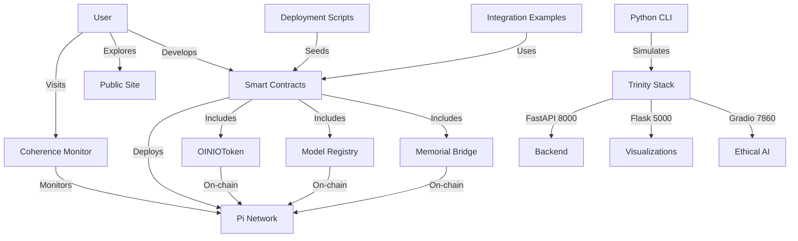

# 🎭 OINIO Demo Dashboard

### Your Gateway to the Quantum Pi Forge Constellation

**Created:** December 21, 2024  
**Last Updated:** December 21, 2024

---

## 🌟 Welcome to OINIO

**OINIO** (Ontological Intelligence Network Incentive Organism) is a production-ready ecosystem for ethical AI validation on Pi Network. This dashboard serves as your central navigation hub for exploring all demos, tools, and examples across the Quantum Pi Forge constellation.

Whether you're a curious newcomer, a developer looking to integrate OINIO contracts, or a system operator deploying AI models, this dashboard will guide you to the right starting point.

### What Can You Do With OINIO?

- 🌐 **Experience Live Demos** - See real-time quantum coherence monitoring
- 💼 **Integrate Smart Contracts** - Deploy ERC-20 tokens and NFT registries on Pi Network
- 🏛️ **Explore Governance** - Understand community-driven memorial systems
- 🎬 **Deploy AI Models** - Use production-ready deployment scripts
- 🔧 **Build Applications** - Leverage comprehensive integration examples

---

## 📑 Table of Contents

1. [🧭 Choose Your Path](#-choose-your-path)
2. [🌐 Live Demos (Public - No Setup Required)](#-live-demos-public---no-setup-required)
   - [Quantum Coherence Monitor](#1-quantum-coherence-monitor)
   - [Public Site](#2-public-site)
3. [💼 Developer Demos (Technical Setup Required)](#-developer-demos-technical-setup-required)
   - [Smart Contract Suite](#3-smart-contract-suite)
   - [Frontend Integration Examples](#4-frontend-integration-examples)
4. [🏛️ Memorial Demos (Community & Governance)](#%EF%B8%8F-memorial-demos-community--governance)
   - [OINIO Memorial Bridge](#5-oinio-memorial-bridge)
5. [🎬 Interactive Demos (Operators & Advanced Users)](#-interactive-demos-operators--advanced-users)
   - [Python CLI Demo](#6-python-cli-demo)
   - [Model Deployment Scripts](#7-model-deployment-scripts)
6. [🏗️ Architecture Overview](#%EF%B8%8F-architecture-overview)
7. [🌌 Constellation Map](#-constellation-map)
8. [🤝 Contributing to Demos](#-contributing-to-demos)
9. [💬 Support & Resources](#-support--resources)
10. [❓ FAQ](#-faq)

[⬆️ Back to Top](#-oinio-demo-dashboard)

---

## 🧭 Choose Your Path

Not sure where to start? Use this matrix to find the perfect entry point based on your goals and experience level:

| I want to... | Start here | Time | Difficulty |
|--------------|------------|------|------------|
| See OINIO in action | [Quantum Coherence Monitor](#1-quantum-coherence-monitor) | 2 min | 🟢 Easy |
| Explore the ecosystem | [Public Site](#2-public-site) | 5 min | 🟢 Easy |
| Integrate OINIO contracts | [Smart Contract Suite](#3-smart-contract-suite) | 60 min | 🟡 Medium |
| Build a frontend | [Frontend Integration Examples](#4-frontend-integration-examples) | 90 min | 🟡 Medium |
| Deploy AI models | [Model Deployment Scripts](#7-model-deployment-scripts) | 30 min | 🔴 Advanced |
| Understand governance | [OINIO Memorial Bridge](#5-oinio-memorial-bridge) | 40 min | 🟡 Medium |
| Try CLI tools | [Python CLI Demo](#6-python-cli-demo) | 15 min | 🟢 Easy |

**Difficulty Legend:**
- 🟢 **Easy** - No technical setup required, accessible to everyone
- 🟡 **Medium** - Basic development experience needed (command line, Git, programming)
- 🔴 **Advanced** - Production deployment experience required

[⬆️ Back to Top](#-oinio-demo-dashboard)

---

## 🌐 Live Demos (Public - No Setup Required)

These demos are live and accessible to everyone. No installation, no configuration—just click and explore.

### 1. Quantum Coherence Monitor

**Status:** ✅ Live

**Description:**  
A real-time visualization dashboard showing quantum coherence metrics, system latency, guardian state, and the health of the autonomous AI platform. Experience the heartbeat of the Quantum Pi Forge ecosystem.

**Live URL:**  
🔗 [https://pi-forge-quantum-genesis.vercel.app](https://pi-forge-quantum-genesis.vercel.app)

**Features:**
- Real-time quantum coherence metrics
- System latency monitoring
- Guardian state visualization
- Interactive UI with live updates
- Cyber-samurai themed design
- WebSocket-powered streaming data

**What You'll See:**
- Guardian state indicators (Active, Pending, Inactive)
- Coherence scores with color-coded status
- Latency graphs and metrics
- System health monitoring
- Trinity framework status (FastAPI, Flask, Gradio)

**Audience:** Everyone - General public, developers, operators, stakeholders

**Time Required:** 2-5 minutes

**Local File:** `index.html`

**How to Run Locally (Optional):**
```bash
# Simply open the file in your browser
open index.html

# Or use a local server
python -m http.server 8080
# Then visit: http://localhost:8080
```

**Learn More:**
- Architecture details: [docs/ARCHITECTURE.md](ARCHITECTURE.md)
- Guardian system: [docs/GUARDIAN_APPROVAL_SYSTEM.md](GUARDIAN_APPROVAL_SYSTEM.md)

[⬆️ Back to Top](#-oinio-demo-dashboard)

---

### 2. Public Site

**Status:** ✅ Live

**Description:**  
The main public portal for Quantum Pi Forge. This site provides ecosystem overviews, documentation, and entry points for contributors and users exploring the OINIO constellation.

**Repository:**  
🔗 [onenoly1010/quantum-pi-forge-site](https://github.com/onenoly1010/quantum-pi-forge-site)

**Key Files:**
- `index.html` - Main landing page
- `dashboard.html` - System dashboard

**Features:**
- Ecosystem overview and introduction
- Documentation navigation
- Getting started guides
- Community resources
- Visual system architecture

**Audience:** General public, new contributors, stakeholders

**Time Required:** 5-10 minutes

**How to Access:**
1. Visit the repository: [quantum-pi-forge-site](https://github.com/onenoly1010/quantum-pi-forge-site)
2. Browse the HTML files
3. Clone and run locally if desired

**Status:** 🔵 Documentation & Static Site

[⬆️ Back to Top](#-oinio-demo-dashboard)

---

## 💼 Developer Demos (Technical Setup Required)

These demos require development environment setup but provide comprehensive examples for integrating OINIO into your applications.

### 3. Smart Contract Suite

**Status:** ✅ Complete (37/37 Tests Passing)

**Description:**  
Production-ready Solidity smart contracts for the OINIO ecosystem on Pi Network. This suite includes an ERC-20 token (1 billion supply) and an ERC-721 NFT-based registry for AI models with comprehensive testing and deployment infrastructure.

**Location:** `contracts/` directory

**Components:**

#### OINIOToken.sol (ERC-20)
- **Token Name:** OINIO Token
- **Symbol:** OINIO
- **Decimals:** 18
- **Total Supply:** 1,000,000,000 OINIO (1 billion, fixed)
- **Features:** Burnable, Ownable, deflationary mechanics
- **Deployment Gas:** ~679K

#### OINIOModelRegistry.sol (ERC-721)
- **Purpose:** NFT-based registry for AI models
- **Features:** IPFS metadata, token staking, access control, searchable
- **Deployment Gas:** ~2.03M
- **Model Structure:** ID, creator, name, IPFS URI, stake amount, timestamp, active status

**Test Coverage:**
- **OINIOToken Tests:** 15 tests (100% passing)
  - Deployment, transfers, approvals, burn mechanics, ownership
- **OINIOModelRegistry Tests:** 22 tests (100% passing)
  - Registration, staking, metadata updates, transfers, queries, access control

**Quick Start:**

```bash
# Navigate to contracts directory
cd contracts

# Install dependencies (Foundry required)
forge install

# Compile contracts
forge build

# Run all tests
forge test

# Run tests with verbosity
forge test -vv

# Run tests with gas reporting
forge test --gas-report

# Run specific test file
forge test --match-path test/OINIOToken.t.sol
```

**Prerequisites:**
- [Foundry](https://book.getfoundry.sh/getting-started/installation) installed
- Git
- Basic Solidity knowledge

**Deploy to Pi Network:**

```bash
# Configure environment
cp .env.example .env
# Edit .env with your private key and RPC URLs

# Deploy to Pi Testnet (Chain ID: 2025)
forge script script/Deploy.s.sol \
  --rpc-url $RPC_URL_TESTNET \
  --private-key $PRIVATE_KEY \
  --broadcast \
  --verify

# Deploy to Pi Mainnet (Chain ID: 314159)
forge script script/Deploy.s.sol \
  --rpc-url $RPC_URL_MAINNET \
  --private-key $PRIVATE_KEY \
  --broadcast \
  --verify
```

**Documentation:**
- 📖 [contracts/README.md](../contracts/README.md) - Complete guide
- 📖 [contracts/INTEGRATION_EXAMPLE.md](../contracts/INTEGRATION_EXAMPLE.md) - Frontend examples
- 📖 [contracts/DEPLOYMENT_CHECKLIST.md](../contracts/DEPLOYMENT_CHECKLIST.md) - Production deployment
- 📖 [contracts/VERIFICATION.md](../contracts/VERIFICATION.md) - Security audit
- 📖 [OINIO_SMART_CONTRACTS_COMPLETE.md](../OINIO_SMART_CONTRACTS_COMPLETE.md) - Implementation summary

**Contract ABIs:**
After compilation, ABIs are available in:
- `out/OINIOToken.sol/OINIOToken.json`
- `out/OINIOModelRegistry.sol/OINIOModelRegistry.json`

**Audience:** Blockchain developers, smart contract engineers

**Time Required:** 30-60 minutes (setup + testing), 2-4 hours (full deployment)

**Difficulty:** 🟡 Medium (requires Foundry, Solidity knowledge)

[⬆️ Back to Top](#-oinio-demo-dashboard)

---

### 4. Frontend Integration Examples

**Status:** ✅ Complete

**Description:**  
Comprehensive guide for integrating OINIO smart contracts into your frontend application. Includes complete examples using Ethers.js and Web3.js, React components, event listeners, and error handling patterns.

**Location:** `contracts/INTEGRATION_EXAMPLE.md`

**What's Included:**

#### Setup & Configuration
- Contract initialization
- Network configuration (Testnet/Mainnet)
- ABI imports
- Provider and signer setup

#### Token Operations (ERC-20)
- Check balances
- Transfer tokens
- Approve spending
- Burn tokens
- Monitor transfer events

#### Model Registry Operations (ERC-721)
- Register AI models
- Update model metadata
- Transfer model ownership
- Query models by creator
- Deactivate models
- Listen to registration events

#### React Components
- Token balance display
- Model registration form
- Model list viewer
- Transaction status handler

#### Advanced Patterns
- Event listening and filtering
- Error handling best practices
- Transaction confirmation
- Loading states and UX
- Gas estimation
- Network switching

**Quick Start:**

```bash
# Install dependencies
npm install ethers
# or
npm install web3

# Copy integration examples
cp contracts/INTEGRATION_EXAMPLE.md ./integration-guide.md

# Follow examples in your project
```

**Example: Register an AI Model (Ethers.js)**

```javascript
import { ethers } from 'ethers';

// Initialize contracts
const provider = new ethers.JsonRpcProvider('https://api.testnet.minepi.com/rpc');
const signer = await provider.getSigner();

const token = new ethers.Contract(tokenAddress, OINIOTokenABI, signer);
const registry = new ethers.Contract(registryAddress, RegistryABI, signer);

// Approve token spending
const approveTx = await token.approve(registryAddress, stakeAmount);
await approveTx.wait();

// Register model
const registerTx = await registry.registerModel(
  "Ethics Validator v1",
  "ipfs://Qm...",
  ethers.parseEther("100")
);
await registerTx.wait();

console.log("Model registered successfully!");
```

**Languages/Frameworks:**
- JavaScript/TypeScript (Ethers.js v6)
- JavaScript (Web3.js)
- React.js
- Next.js compatible

**Documentation:**
- 📖 [contracts/INTEGRATION_EXAMPLE.md](../contracts/INTEGRATION_EXAMPLE.md) - Full guide

**Audience:** Frontend developers, full-stack developers, dApp builders

**Time Required:** 45-90 minutes

**Difficulty:** 🟡 Medium (requires JavaScript/React knowledge)

[⬆️ Back to Top](#-oinio-demo-dashboard)

---

## 🏛️ Memorial Demos (Community & Governance)

These demos showcase the community governance and memorial aspects of the OINIO ecosystem.

### 5. OINIO Memorial Bridge

**Status:** ✅ Complete (Soroban Smart Contract)

**Description:**  
A permanent on-chain memorial smart contract that honors families with a permanent blockchain message. This Soroban contract on Pi Network serves as an immutable tribute and demonstrates transparent, community-driven governance.

**Location:** `contracts/oinio-memorial-bridge/`

**Memorial Message:**  
> "OINIO: For the Beloved Keepers of the Northern Gateway. Not in vain."

**Purpose:**
- Honor families with permanent on-chain memorial
- Anchor 1 billion OINIO supply dedication
- Preserve Facebook open letter URL on blockchain
- Demonstrate transparent, immutable governance

**Contract Type:** Soroban smart contract (Rust)

**Key Functions:**
- `initialize(admin)` - Set up memorial with sacred message
- `anchor_letter(url)` - Permanently store open letter URL
- `get_message()` - Read memorial message
- `get_letter()` - Read anchored letter URL
- `get_supply()` - Read memorial supply (1B OINIO)

**Quick Start:**

```bash
# Navigate to memorial contract
cd contracts/oinio-memorial-bridge

# Build the contract
chmod +x build.sh
./build.sh

# Run tests
cargo test

# Deploy to Pi Network Mainnet (requires setup)
chmod +x deploy.sh
./deploy.sh
```

**Prerequisites:**

1. **Install Rust:**
   ```bash
   curl --proto '=https' --tlsv1.2 -sSf https://sh.rustup.rs | sh
   source $HOME/.cargo/env
   ```

2. **Install Soroban CLI:**
   ```bash
   cargo install --locked soroban-cli --features opt
   rustup target add wasm32-unknown-unknown
   ```

3. **Configure Pi Network:**
   ```bash
   soroban config network add pi-mainnet \
     --rpc-url https://api.mainnet.minepi.com/soroban/rpc \
     --network-passphrase "Pi Network Mainnet"
   
   soroban config identity generate onenoly1010
   ```

**Verification:**

After deployment, verify the contract:
```bash
CONTRACT_ID=$(cat contract_address.txt)
soroban contract invoke --id $CONTRACT_ID --network pi-mainnet -- get_message
```

Expected output:
```
"OINIO: For the Beloved Keepers of the Northern Gateway. Not in vain."
```

**Files:**
```
contracts/oinio-memorial-bridge/
├── src/
│   └── lib.rs              # Smart contract source code
├── Cargo.toml              # Rust dependencies
├── build.sh                # Build script
├── deploy.sh               # Deployment script
├── README.md               # Documentation
└── contract_address.txt    # Deployed address (after deployment)
```

**Documentation:**
- 📖 [contracts/oinio-memorial-bridge/README.md](../contracts/oinio-memorial-bridge/README.md)
- 📖 [docs/SUCCESSION_CEREMONY.md](SUCCESSION_CEREMONY.md) - Governance context

**Audience:** Community members, governance participants, memorial stakeholders

**Time Required:** 20-40 minutes (setup + testing), 1-2 hours (full deployment)

**Difficulty:** 🟡 Medium (requires Rust, Soroban CLI)

**Principles:**
- **Transparency:** All code is open source and auditable
- **Immutability:** Blockchain ensures the memorial lasts forever
- **Sovereignty:** Community-governed, no single point of control
- **Remembrance:** Honoring those who came before

[⬆️ Back to Top](#-oinio-demo-dashboard)

---

## 🎬 Interactive Demos (Operators & Advanced Users)

These demos provide interactive tools for system operators, deployment teams, and advanced users.

### 6. Python CLI Demo

**Status:** ✅ Complete

**Description:**  
An interactive command-line demonstration of the Quantum Resonance Lattice architecture. This Python script provides a live, async demonstration with browser integration, showcasing the tri-dimensional architecture (FastAPI, Flask, Gradio).

**Location:** `simple_demo.py`

**Features:**
- ASCII art banner with Quantum Resonance Lattice visualization
- Live telemetry pulse simulation
- Pi Network payment flow simulation
- Harmony Sentinel command demonstration
- Trinity framework status (FastAPI:8000, Flask:5000, Gradio:7860)
- Browser auto-launch integration
- Async/await architecture demonstration

**Quick Start:**

```bash
# Run the demo
python simple_demo.py

# The script will:
# 1. Display the Quantum Resonance Lattice banner
# 2. Simulate telemetry pulses
# 3. Show payment flow phases
# 4. Open browser automatically (optional)
```

**What You'll See:**

```
╔═══════════════════════════════════════════════════════╗
║           🌌 QUANTUM RESONANCE LATTICE 🌌            ║
║                                                       ║
║  🧠 FastAPI:8000  - Quantum Conduit (Auth/WebSocket) ║
║  🎨 Flask:5000    - Glyph Weaver (SVG Visualizations)║
║  ⚖️ Gradio:7860   - Truth Mirror (Ethical Audits)    ║
║                                                       ║
║           🎼 The Trinity Awakens 🎼                   ║
╚═══════════════════════════════════════════════════════╝
```

**Telemetry Output:**
```json
{
  "timestamp": "2024-12-21T00:00:00.000Z",
  "harmony_index": 0.696,
  "sentinel_command": "Initiate TRC",
  "synthesis_yield": 0.788,
  "entropy_grace": 0.0799,
  "ethical_entropy": 0.036,
  "payment_flow_state": "Growing (Green)",
  "tx_count": 44,
  "quantum_phase": "Foundation → Growth → Harmony → Transcendence"
}
```

**Prerequisites:**
- Python 3.8+
- No additional dependencies (uses standard library)

**Use Cases:**
- Understanding the tri-dimensional architecture
- Demonstrating system capabilities
- Testing async patterns
- Onboarding technical operators

**Audience:** Technical operators, system administrators, backend developers

**Time Required:** 10-15 minutes

**Difficulty:** 🟢 Easy (basic Python knowledge)

[⬆️ Back to Top](#-oinio-demo-dashboard)

---

### 7. Model Deployment Scripts

**Status:** 🟡 Framework (IPFS & SDK integration pending)

**Description:**  
Production-ready deployment framework for the six foundational MR-NFT AI models on Pi Network. This script handles model metadata generation, IPFS upload (pending), and smart contract deployment (pending) with comprehensive dry-run testing capabilities.

**Location:** `scripts/seed_first_six_models.py`

**The Six Seed Models:**

1. **Ethics Validator** - Multi-dimensional ethics framework validation
2. **Bias Detector** - Identifies and quantifies algorithmic biases
3. **Privacy Auditor** - Audits data handling and privacy compliance
4. **Transparency Scorer** - Evaluates explainability and interpretability
5. **Fairness Analyzer** - Measures fairness across demographics
6. **Accountability Tracker** - Tracks AI decisions and accountability

**Quick Start:**

```bash
# Dry run (testnet simulation) - RECOMMENDED
python scripts/seed_first_six_models.py --dry-run

# Deploy single model (requires SDK setup)
python scripts/seed_first_six_models.py --model "Ethics Validator" --execute

# Deploy all six models (requires confirmation)
python scripts/seed_first_six_models.py --execute-all --confirm

# Deploy with custom gas limit
python scripts/seed_first_six_models.py --execute-all --confirm --gas-limit 3000000
```

**Output (Dry Run):**
```
═══════════════════════════════════════════════════════════
🌊 OINIO Model Seeding Script
═══════════════════════════════════════════════════════════

Mode: DRY RUN (Simulation - no actual deployment)

[1/6] Processing: Ethics Validator
      Model ID: oinio/ethics-validator-v1
      Metadata generated ✓
      IPFS upload simulated ✓
      Contract deployment simulated ✓

[2/6] Processing: Bias Detector
      Model ID: oinio/bias-detector-v1
      ...

═══════════════════════════════════════════════════════════
Summary: 6/6 models processed successfully
═══════════════════════════════════════════════════════════
```

**Prerequisites:**
- Python 3.8+
- `python-dotenv` (optional, for environment variables)
- Pi Network SDK (for actual deployment - not yet implemented)

**Environment Configuration:**
```bash
# Create .env file
PI_NETWORK_API_KEY=your_api_key_here
PI_WALLET_ADDRESS=your_wallet_address
PI_PRIVATE_KEY=your_private_key
IPFS_API_KEY=your_ipfs_key
```

**⚠️ Important Notes:**
- Currently operates in **FRAMEWORK MODE**
- IPFS upload integration pending (TODO in code)
- Smart contract deployment integration pending (TODO in code)
- Use `--dry-run` for testing and demonstration
- See `docs/DEPLOYMENT_CHECKLIST.md` for detailed deployment guide

**Model Metadata Structure:**
```python
{
    "name": "Ethics Validator",
    "description": "Validates AI systems against ethics frameworks",
    "model_id": "oinio/ethics-validator-v1",
    "version": "1.0.0",
    "category": "ethics",
    "capabilities": ["fairness", "transparency", "accountability"],
    "stake_requirement": "100 OINIO",
    "created_at": "2024-12-21T00:00:00Z"
}
```

**Documentation:**
- 📖 [docs/DEPLOYMENT_CHECKLIST.md](DEPLOYMENT_CHECKLIST.md) - Complete deployment guide
- 📖 [scripts/seed_first_six_models.py](../scripts/seed_first_six_models.py) - Source code with comments

**Audience:** System operators, deployment teams, DevOps engineers

**Time Required:** 
- 15-30 minutes (dry-run testing)
- 2-4 hours (full deployment, when SDK is integrated)

**Difficulty:** 🔴 Advanced (requires deployment experience, environment setup)

**Future Enhancements:**
- Complete Pi Network SDK integration
- IPFS upload implementation
- Smart contract deployment automation
- Rollback and verification procedures

[⬆️ Back to Top](#-oinio-demo-dashboard)

---

## 🏗️ Architecture Overview

Understanding how these demos connect within the broader Quantum Pi Forge ecosystem:

### System Layers

```
┌─────────────────────────────────────────────────────────────────────┐
│                      🌐 FRONTEND DEMOS                               │
│  ┌─────────────────────┐         ┌─────────────────────┐           │
│  │ Coherence Monitor   │         │   Public Site       │           │
│  │   (index.html)      │         │ (quantum-pi-forge-  │           │
│  │                     │         │      site)          │           │
│  │ • Real-time metrics │         │ • Documentation     │           │
│  │ • Guardian state    │         │ • Onboarding        │           │
│  │ • WebSocket UI      │         │ • Resources         │           │
│  └──────────┬──────────┘         └──────────┬──────────┘           │
└─────────────┼─────────────────────────────────┼─────────────────────┘
              │                                 │
              ▼                                 ▼
┌─────────────────────────────────────────────────────────────────────┐
│                   💼 SMART CONTRACT LAYER                            │
│                                                                       │
│  ┌─────────────────┐  ┌─────────────────┐  ┌─────────────────┐    │
│  │ OINIOToken.sol  │  │ Model Registry  │  │ Memorial Bridge │    │
│  │   (ERC-20)      │  │   (ERC-721)     │  │   (Soroban)     │    │
│  │                 │  │                 │  │                 │    │
│  │ • 1B supply     │  │ • AI model NFTs │  │ • Immutable     │    │
│  │ • Burnable      │  │ • IPFS metadata │  │ • Memorial      │    │
│  │ • Transfers     │  │ • Staking       │  │ • Governance    │    │
│  └─────────────────┘  └─────────────────┘  └─────────────────┘    │
└───────────────────────────┬─────────────────────────────────────────┘
                            │
                            ▼
┌─────────────────────────────────────────────────────────────────────┐
│                    ⛓️ BLOCKCHAIN LAYER                               │
│                                                                       │
│  ┌─────────────────────────────────────────────────────────────┐   │
│  │              Pi Network Blockchain                           │   │
│  │                                                               │   │
│  │  • Testnet (Chain ID: 2025)                                 │   │
│  │  • Mainnet (Chain ID: 314159)                               │   │
│  │  • Soroban smart contracts                                  │   │
│  │  • Immutable state                                          │   │
│  │  • Transparent transactions                                 │   │
│  └─────────────────────────────────────────────────────────────┘   │
└─────────────────────────────────────────────────────────────────────┘
              │                                 │
              ▼                                 ▼
┌─────────────────────────────────────────────────────────────────────┐
│               🎬 DEPLOYMENT & OPERATIONS LAYER                       │
│                                                                       │
│  ┌─────────────────┐  ┌─────────────────┐  ┌─────────────────┐    │
│  │ Python CLI Demo │  │ Model Deployment│  │ Integration      │    │
│  │ (simple_demo.py)│  │ (seed_first_six │  │ Examples         │    │
│  │                 │  │  _models.py)    │  │                 │    │
│  │ • CLI interface │  │ • 6 AI models   │  │ • Ethers.js     │    │
│  │ • Async demo    │  │ • IPFS upload   │  │ • Web3.js       │    │
│  │ • Trinity stack │  │ • Registry      │  │ • React         │    │
│  └─────────────────┘  └─────────────────┘  └─────────────────┘    │
└─────────────────────────────────────────────────────────────────────┘
```

### Demo Interaction Flow



### Key Connections

1. **Frontend → Smart Contracts:** Integration examples show how to connect web UIs to on-chain contracts
2. **Smart Contracts → Blockchain:** All contracts deploy to Pi Network (testnet/mainnet)
3. **Scripts → Deployment:** Model deployment scripts interact with registry contracts
4. **Monitor → System:** Coherence monitor displays real-time system state
5. **Memorial → Governance:** Bridge contract demonstrates community governance

**For detailed architecture information:**
- 📖 [docs/ARCHITECTURE.md](ARCHITECTURE.md) - Complete system architecture
- 📖 [docs/SUCCESSION_CEREMONY.md](SUCCESSION_CEREMONY.md) - Governance structure

[⬆️ Back to Top](#-oinio-demo-dashboard)

---

## 🌌 Constellation Map

The Quantum Pi Forge ecosystem consists of 9 repositories, each sovereign but aligned through the Canon of Autonomy:

### Core Repositories

| # | Repository | Purpose | Demo Relationship |
|---|------------|---------|-------------------|
| 1 | **pi-forge-quantum-genesis** | Coordination hub, main backend | 🎯 **This repository** - Contains most demos |
| 2 | **quantum-pi-forge-site** | Public portal | [Public Site demo](#2-public-site) |
| 3 | **quantum-resonance-clean** | Harmonic ledger implementation | Backend infrastructure |
| 4 | **pi-mr-nft-agent** | NFT agent system | AI model agent framework |
| 5 | **pi-mr-nft-contracts** | NFT smart contracts | Related to Model Registry |
| 6 | **quantum-pi-forge-fixed** | Fixed implementation | Production deployment |
| 7 | **pi-forge-quantum-genesis-OPEN** | Open-source backend | Public development |
| 8 | **quantum-pi-forge-ignited** | Active instance | Live deployment |
| 9 | **oinio-soul-system** | Ethics & governance logic | Ethical AI foundation |

### How They Connect

```
                    pi-forge-quantum-genesis (Hub)
                             │
            ┌────────────────┼────────────────┐
            │                │                │
            ▼                ▼                ▼
    quantum-pi-forge-   pi-mr-nft-      oinio-soul-
         site           contracts         system
    (Public Portal)   (NFT Layer)    (Ethics Layer)
            │                │                │
            └────────────────┼────────────────┘
                            │
                    ┌───────┴───────┐
                    ▼               ▼
           quantum-resonance   quantum-pi-forge-
               -clean             ignited
          (Harmonic Ledger)   (Live Instance)
```

### Repository Status

- ✅ **Active** - Actively maintained, demos available
- 🔧 **Development** - Under active development
- 📚 **Documentation** - Primary documentation repository
- 🚀 **Production** - Live production deployment

### Cross-Repository Demos

Some demos span multiple repositories:

1. **Smart Contract Suite** → Uses contracts from this repo, deployed to Pi Network
2. **Public Site** → Separate repository, links to this hub
3. **NFT System** → Combines pi-mr-nft-contracts + pi-mr-nft-agent
4. **Ethics Framework** → oinio-soul-system provides foundation for model validation

### Navigation

Each repository maintains its own README with demo links. This dashboard serves as the **canonical entry point** for all demos across the constellation.

**To explore other repositories:**
1. Visit the GitHub organization: [onenoly1010](https://github.com/onenoly1010)
2. Each repo has its own README with specific demos
3. Refer back to this dashboard for ecosystem-wide navigation

[⬆️ Back to Top](#-oinio-demo-dashboard)

---

## 🤝 Contributing to Demos

Want to improve existing demos or add new ones? Here's how to contribute:

### Improving Existing Demos

1. **Identify the Demo**
   - Find the demo in this dashboard
   - Note its location (file path or repository)
   - Check its current status

2. **Understand the Canon**
   - Read [canon/README.md](../canon/README.md)
   - Review [docs/SUCCESSION_CEREMONY.md](SUCCESSION_CEREMONY.md)
   - Ensure your changes maintain:
     - **Sovereignty** (each component maintains independence)
     - **Transparency** (clear documentation)
     - **Autonomy** (self-documenting, no hidden dependencies)
     - **Accessibility** (welcoming to newcomers)

3. **Make Your Changes**
   ```bash
   # Fork the repository
   git clone https://github.com/onenoly1010/pi-forge-quantum-genesis.git
   cd pi-forge-quantum-genesis
   
   # Create a branch
   git checkout -b improve-demo-name
   
   # Make your changes
   # Test thoroughly
   
   # Commit with clear messages
   git commit -m "Improve [Demo Name]: [specific improvement]"
   
   # Push and create PR
   git push origin improve-demo-name
   ```

4. **Test Your Changes**
   - For smart contracts: Run `forge test`
   - For Python scripts: Test with `--dry-run` flag
   - For HTML demos: Test in multiple browsers
   - For documentation: Check all links work

5. **Submit a Pull Request**
   - Clear title describing the improvement
   - Detailed description of changes
   - Screenshots/recordings if UI changes
   - Link to related issues
   - Canon alignment statement

### Adding New Demos

1. **Propose the Demo**
   - Open a GitHub issue
   - Describe the demo purpose
   - Explain how it fits the ecosystem
   - Get feedback from maintainers

2. **Choose the Right Repository**
   - **This repo** (pi-forge-quantum-genesis): Backend demos, CLI tools, contracts
   - **quantum-pi-forge-site**: Public-facing HTML/CSS demos
   - **Specialized repos**: NFT-specific, ethics-specific demos

3. **Create the Demo**
   - Follow existing patterns
   - Include comprehensive README
   - Add to this dashboard
   - Maintain Canon alignment

4. **Documentation Requirements**
   - Clear description
   - Prerequisites list
   - Quick start guide
   - Expected output/screenshots
   - Troubleshooting section
   - Time estimate and difficulty level

5. **Update This Dashboard**
   - Add entry in appropriate category
   - Update Quick Start Matrix
   - Add to Architecture Overview if relevant
   - Update Constellation Map if new repo

### Testing Procedures

#### Smart Contract Demos
```bash
cd contracts
forge test -vv
forge test --gas-report
```

#### Python Demos
```bash
# Test CLI demos
python simple_demo.py

# Test deployment scripts in dry-run mode
python scripts/seed_first_six_models.py --dry-run
```

#### Frontend Demos
- Test in Chrome, Firefox, Safari
- Check mobile responsiveness
- Verify all links work
- Test with slow network conditions

#### Documentation Demos
- Check markdown rendering
- Verify all links (internal and external)
- Test code examples
- Ensure accessibility (screen readers)

### Canon Alignment Checklist

Before submitting, verify:

- [ ] **Sovereignty:** Demo can run independently
- [ ] **Transparency:** All code and documentation is clear
- [ ] **No Hierarchy:** Demo doesn't create dependencies or gatekeeping
- [ ] **Welcoming:** Newcomers can understand and use it
- [ ] **Self-Documenting:** README explains everything
- [ ] **Maintenance:** Clear how to update/maintain the demo
- [ ] **Status Indicators:** Honest about completeness and functionality

### Review Process

1. Maintainers review for Canon alignment
2. Technical review for correctness
3. Testing by other contributors
4. Documentation review
5. Merge and deploy

**Need help?** Open an issue or ask in discussions.

[⬆️ Back to Top](#-oinio-demo-dashboard)

---

## 💬 Support & Resources

### Getting Help

**GitHub Issues:**  
🔗 [https://github.com/onenoly1010/pi-forge-quantum-genesis/issues](https://github.com/onenoly1010/pi-forge-quantum-genesis/issues)

Use issues for:
- Bug reports in demos
- Feature requests
- Documentation improvements
- Questions about demos

**Documentation Index:**
- 📖 [docs/ARCHITECTURE.md](ARCHITECTURE.md) - System architecture
- 📖 [docs/SUCCESSION_CEREMONY.md](SUCCESSION_CEREMONY.md) - Governance
- 📖 [docs/DEPLOYMENT_CHECKLIST.md](DEPLOYMENT_CHECKLIST.md) - Production deployment
- 📖 [docs/GUARDIAN_APPROVAL_SYSTEM.md](GUARDIAN_APPROVAL_SYSTEM.md) - Guardian system
- 📖 [contracts/README.md](../contracts/README.md) - Smart contracts guide
- 📖 [contracts/INTEGRATION_EXAMPLE.md](../contracts/INTEGRATION_EXAMPLE.md) - Frontend integration
- 📖 [canon/README.md](../canon/README.md) - Canon of Autonomy

### Quick Reference Guides

- 📖 [docs/QUICK_START.md](QUICK_START.md) - Quick start guide
- 📖 [docs/AI_AGENT_QUICK_REFERENCE.md](AI_AGENT_QUICK_REFERENCE.md) - AI agent reference
- 📖 [docs/PI_NETWORK_QUICK_REFERENCE.md](PI_NETWORK_QUICK_REFERENCE.md) - Pi Network integration
- 📖 [docs/GUARDIAN_QUICK_REFERENCE.md](GUARDIAN_QUICK_REFERENCE.md) - Guardian system

### External Resources

**Pi Network:**
- 🌐 [Pi Network](https://minepi.com/)
- 📖 [Pi Network Developer Portal](https://developers.minepi.com/)
- 📖 [Pi Blockchain Explorer](https://pi.network/explorer)

**Development Tools:**
- 🔧 [Foundry Book](https://book.getfoundry.sh/)
- 🔧 [Ethers.js Documentation](https://docs.ethers.org/)
- 🔧 [Soroban Documentation](https://soroban.stellar.org/docs)

**Related Projects:**
- 🔗 [OpenZeppelin Contracts](https://docs.openzeppelin.com/contracts/)
- 🔗 [IPFS Documentation](https://docs.ipfs.tech/)

### Community

**Lead Guardian:** @onenoly1010  
**AI Assistant:** @app/copilot-swe-agent

**Ways to Contribute:**
- Report bugs or issues
- Improve documentation
- Add new demos
- Enhance existing demos
- Test and provide feedback
- Help other contributors

### Maintenance & Updates

**This dashboard is maintained by:**
- Community contributors
- The GitHub Agent
- Documentation specialists
- Lead Guardian oversight

**Last Updated:** December 21, 2024

**Update Process:**
1. Submit PR with proposed changes
2. Review by maintainers
3. Canon alignment check
4. Merge and update timestamp

**To request updates:**
- Open an issue with "Dashboard Update" label
- Describe what needs updating
- Provide new information or links

[⬆️ Back to Top](#-oinio-demo-dashboard)

---

## ❓ FAQ

### General Questions

**Q: What is OINIO?**  
A: OINIO (Ontological Intelligence Network Incentive Organism) is a production-ready ecosystem for ethical AI validation on Pi Network. It includes smart contracts, AI model registries, and governance frameworks.

**Q: Do I need to install anything to try the demos?**  
A: It depends! Live demos (Coherence Monitor, Public Site) require nothing—just a web browser. Developer demos require development tools like Foundry, Python, or Rust.

**Q: Which demo should I start with?**  
A: See the [Choose Your Path](#-choose-your-path) matrix! For absolute beginners, start with the [Quantum Coherence Monitor](#1-quantum-coherence-monitor). For developers, try the [Smart Contract Suite](#3-smart-contract-suite).

**Q: Are these demos production-ready?**  
A: Most are! Check the status indicator for each demo:
- ✅ Live/Complete - Production ready
- 🟡 Beta/Framework - In development, some features pending
- 🔵 Documentation Only - Reference/educational
- 🟢 Ready to Use - Fully functional

### Technical Questions

**Q: What blockchain does OINIO use?**  
A: Pi Network blockchain. Testnet (Chain ID: 2025) and Mainnet (Chain ID: 314159).

**Q: Can I deploy these contracts to other networks?**  
A: The contracts are standard Solidity (ERC-20, ERC-721) and could be deployed to any EVM-compatible chain with minor configuration changes. However, they're optimized for Pi Network.

**Q: Why is the Model Deployment script in "framework mode"?**  
A: The IPFS upload and Pi SDK integration are not yet implemented. Use `--dry-run` for testing. Full implementation coming soon.

**Q: Do I need Pi cryptocurrency to test?**  
A: For testnet deployment, you can get free testnet Pi from the Pi Network faucet. For mainnet deployment, you'll need real Pi.

**Q: How do I get help with smart contract deployment?**  
A: See [contracts/DEPLOYMENT_CHECKLIST.md](../contracts/DEPLOYMENT_CHECKLIST.md) for detailed steps, or open an issue on GitHub.

### Demo-Specific Questions

**Q: The Coherence Monitor shows "Inactive" guardians—is that a problem?**  
A: No, it's showing the real system state. The monitor is designed to display accurate guardian status, whether active, pending, or inactive.

**Q: Can I use the Memorial Bridge contract for my own memorial?**  
A: The current contract is dedicated to a specific memorial. However, you can fork the code and deploy your own instance for your purposes.

**Q: Where can I find the contract ABIs?**  
A: After running `forge build` in the `contracts/` directory, ABIs are in `out/OINIOToken.sol/OINIOToken.json` and `out/OINIOModelRegistry.sol/OINIOModelRegistry.json`.

**Q: Are the six seed models actually deployed?**  
A: Not yet. The deployment script is currently a framework. Full deployment will occur when the Pi SDK integration is complete.

### Contribution Questions

**Q: Can I add my own demo to this dashboard?**  
A: Yes! See [Contributing to Demos](#-contributing-to-demos). Propose it via GitHub issue first, then submit a PR.

**Q: What is the "Canon of Autonomy"?**  
A: A set of principles governing the ecosystem: sovereignty, transparency, autonomy, accessibility. See [canon/README.md](../canon/README.md).

**Q: Do I need permission to fork and modify demos?**  
A: No! All code is MIT licensed. Fork, modify, and use as you wish. We encourage contributions back to the main repository.

**Q: How do I report a bug in a demo?**  
A: Open a GitHub issue with:
- Demo name
- What you expected
- What actually happened
- Steps to reproduce
- Your environment (OS, browser, etc.)

### Ecosystem Questions

**Q: What's the difference between all the repositories?**  
A: See the [Constellation Map](#-constellation-map). Each repo serves a specific purpose but all align through the Canon. This repo (pi-forge-quantum-genesis) is the coordination hub.

**Q: Why are some repos called "OPEN" or "Ignited"?**  
A: Naming reflects their purpose: "OPEN" for open-source development, "Ignited" for live instances, etc. The naming is part of the mythic-technical resonance of the project.

**Q: Can I contribute to multiple repositories?**  
A: Absolutely! Each is sovereign but welcomes contributions. Start with this coordination hub to understand the ecosystem, then branch out.

### Still Have Questions?

**Open an issue:** [GitHub Issues](https://github.com/onenoly1010/pi-forge-quantum-genesis/issues)  
**Read the docs:** [Documentation Index](#-support--resources)  
**Check the Canon:** [canon/README.md](../canon/README.md)

[⬆️ Back to Top](#-oinio-demo-dashboard)

---

## 📊 Demo Status Summary

Quick overview of all demos:

| Demo | Status | Audience | Time | Difficulty |
|------|--------|----------|------|------------|
| [Quantum Coherence Monitor](#1-quantum-coherence-monitor) | ✅ Live | Everyone | 2-5 min | 🟢 Easy |
| [Public Site](#2-public-site) | 🔵 Documentation | Public | 5-10 min | 🟢 Easy |
| [Smart Contract Suite](#3-smart-contract-suite) | ✅ Complete | Developers | 60 min | 🟡 Medium |
| [Frontend Integration](#4-frontend-integration-examples) | ✅ Complete | Developers | 90 min | 🟡 Medium |
| [Memorial Bridge](#5-oinio-memorial-bridge) | ✅ Complete | Community | 40 min | 🟡 Medium |
| [Python CLI Demo](#6-python-cli-demo) | ✅ Complete | Operators | 15 min | 🟢 Easy |
| [Model Deployment](#7-model-deployment-scripts) | 🟡 Framework | Operators | 30 min | 🔴 Advanced |

**Total Demos:** 7  
**Production Ready:** 5  
**In Development:** 1  
**Documentation Only:** 1

[⬆️ Back to Top](#-oinio-demo-dashboard)

---

## 🎯 Next Steps

Depending on your goals:

### 🌐 I'm New Here
1. ✅ Read this dashboard overview
2. ▶️ Visit [Quantum Coherence Monitor](https://pi-forge-quantum-genesis.vercel.app)
3. ▶️ Explore [docs/ARCHITECTURE.md](ARCHITECTURE.md)
4. ▶️ Review [docs/SUCCESSION_CEREMONY.md](SUCCESSION_CEREMONY.md)

### 💼 I Want to Build
1. ✅ Understand the system architecture
2. ▶️ Set up [Smart Contract Suite](#3-smart-contract-suite)
3. ▶️ Follow [Frontend Integration Examples](#4-frontend-integration-examples)
4. ▶️ Deploy to Pi Testnet
5. ▶️ Build your application

### 🎬 I Want to Deploy
1. ✅ Understand deployment requirements
2. ▶️ Review [docs/DEPLOYMENT_CHECKLIST.md](DEPLOYMENT_CHECKLIST.md)
3. ▶️ Test with [Model Deployment Scripts](#7-model-deployment-scripts) (dry-run)
4. ▶️ Set up environment and credentials
5. ▶️ Deploy to testnet first, then mainnet

### 🤝 I Want to Contribute
1. ✅ Understand the Canon ([canon/README.md](../canon/README.md))
2. ▶️ Review [Contributing to Demos](#-contributing-to-demos)
3. ▶️ Fork the repository
4. ▶️ Make improvements
5. ▶️ Submit pull request

[⬆️ Back to Top](#-oinio-demo-dashboard)

---

## 🌟 Closing

This dashboard is your gateway to the Quantum Pi Forge constellation. Whether you're exploring for the first time, integrating OINIO into your application, or contributing to the ecosystem, you're part of a transparent, sovereign, community-driven system.

**Remember:**
- Each demo is sovereign and self-contained
- All code is transparent and auditable
- The ecosystem is welcoming to contributors
- Documentation is continuously improved

**The OINIO ecosystem exists to:**
- Democratize ethical AI validation
- Empower developers on Pi Network
- Honor community and governance
- Build transparent, autonomous systems

**Welcome to Quantum Pi Forge. The constellation awaits.** 🌌

[⬆️ Back to Top](#-oinio-demo-dashboard)

---

*This dashboard is maintained by the Quantum Pi Forge community. For updates, corrections, or additions, please open an issue or submit a pull request.*

**Canon Alignment:** ✅ Sovereign • ✅ Transparent • ✅ Autonomous • ✅ Welcoming  
**Repository:** [pi-forge-quantum-genesis](https://github.com/onenoly1010/pi-forge-quantum-genesis)  
**License:** MIT
