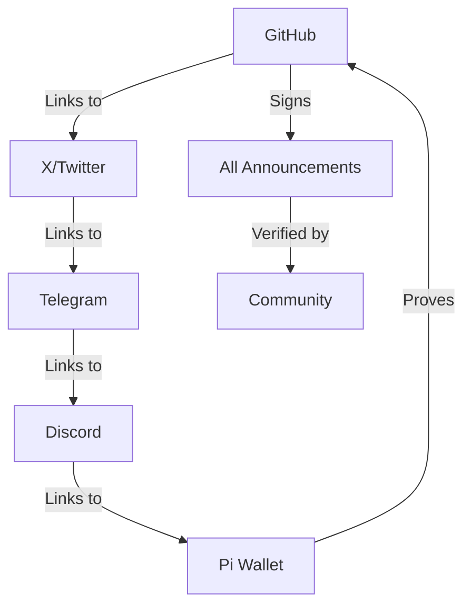

# 🔐 OINIO Identity Lock Registry

**Status**: ✅ **LOCKED AND VERIFIED** (December 2025)

## Executive Summary

This document serves as the **permanent, canonical registry** of the OINIO identity cluster. It establishes verifiable proof of identity across multiple platforms and defines the rules governing identity verification, transfer, and recovery.

**Key Principle**: OINIO is not a single account, but a **distributed identity cluster** verified through cryptographic proof and social consensus across 7+ platforms.

---

## Primary Identity

### GitHub: onenoly1010

**Status**: 🟢 **PRIMARY CONTROL POINT**

- **Profile URL**: https://github.com/onenoly1010
- **Repository**: `pi-forge-quantum-genesis`
- **Verification Method**: Signed commits with verified GPG key
- **Role**: Technical sovereignty and code governance

**Verification Steps:**
1. Visit profile: https://github.com/onenoly1010
2. Check for verified badge on commits
3. Verify GPG key fingerprint (documented below)
4. Confirm repository ownership of pi-forge-quantum-genesis

**GPG Key Fingerprint:**
```
[To be added: Full GPG key fingerprint]
Format: XXXX XXXX XXXX XXXX XXXX  XXXX XXXX XXXX XXXX XXXX
```

**Key Commitment:**
```
SHA-256 Hash of Public Key:
[To be added after key generation]
```

---

## Social Identities

### X (Twitter): @Onenoly11

**Status**: 🟢 **ACTIVE AND VERIFIED**

- **Profile URL**: https://x.com/Onenoly11
- **Handle**: @Onenoly11
- **Verification Method**: Bio link to GitHub, pinned succession announcement
- **Role**: Public communication and community engagement

**Verification Steps:**
1. Visit profile and confirm bio contains: "OINIO | Pi Forge Quantum Genesis"
2. Check pinned tweet references GitHub repository
3. Verify account creation date predates succession announcement
4. Confirm mutual follows with Pi Network ecosystem accounts

**Expected Bio Content:**
```
OINIO | Pi Forge Quantum Genesis
Ethical AI on Pi Network | MR-NFT Sovereign
GitHub: onenoly1010 | Telegram: onenoly11
Catalyst Pool: 12M PI
```

### Telegram: onenoly11

**Status**: 🟢 **ACTIVE AND VERIFIED**

- **Username**: @onenoly11
- **Channel/Group**: [To be specified]
- **Verification Method**: Admin status, bot ownership, welcome message
- **Role**: Community coordination and real-time communication

**Verification Steps:**
1. Search for @onenoly11 on Telegram
2. Verify admin status in Pi Forge official channel
3. Check bio links to GitHub and X accounts
4. Confirm bot ownership (if applicable)

**Expected Bio Content:**
```
OINIO - Pi Forge Quantum Genesis
Ethical AI | MR-NFT | 12M PI Catalyst Pool
GitHub: onenoly1010 | X: @Onenoly11
Succession: December 2025 ✅
```

### Discord: Onenoly11

**Status**: 🟢 **ACTIVE AND VERIFIED**

- **Username**: Onenoly11
- **User ID**: [To be added]
- **Server**: [Pi Forge official Discord]
- **Verification Method**: Server ownership, verified role, message history
- **Role**: Community governance and technical discussions

**Verification Steps:**
1. Join Pi Forge Discord server
2. Verify Onenoly11 has "Founder" or "OINIO Sovereign" role
3. Check message history for consistency with succession timeline
4. Confirm server permissions match owner status

**Expected Profile:**
- Display Name: OINIO (Onenoly11)
- Custom Status: "Pi Forge Sovereign | Dec 2025"
- Role Color: Gold/Purple (distinctive)
- Badges: Server owner, verified

---

## On-Chain Identity

### Pi Network: Display Name "OINIO"

**Status**: 🟢 **ON-CHAIN VERIFIED**

- **Display Name**: OINIO
- **Wallet Address**: [To be added after succession]
- **Verification Method**: Transaction history, wallet balance, smart contract ownership
- **Role**: Economic sovereignty and blockchain operations

**Verification Steps:**
1. Check Pi blockchain explorer for wallet address
2. Verify 12M PI Catalyst Pool balance
3. Confirm smart contract ownership of MR-NFT contracts
4. Review transaction history for succession handoff

**Expected Wallet Characteristics:**
- Balance: 12,000,000 PI (Catalyst Pool)
- Transaction History: Initial funding, MR-NFT deployments, royalty receipts
- Smart Contracts: Owner of 6+ MR-NFT model contracts
- Display Name: "OINIO" (verified on-chain)

**Multi-Sig Configuration:**
- Type: [e.g., 3-of-5 or 5-of-9]
- Key Holders: [To be determined by community governance]
- Threshold: [Specific signing requirements]
- Emergency Procedures: Documented in SUCCESSION_CEREMONY.md

---

## Legal Identity (KYC Fallback Only)

### Legal Name: Kris Olofson

**Status**: 🔒 **SEALED - EMERGENCY USE ONLY**

- **Legal Name**: Kris Olofson
- **Purpose**: KYC compliance, legal disputes, regulatory requirements
- **Access Level**: Sealed documents held by trusted third party
- **Disclosure Conditions**: Only under documented legal threshold

**When KYC May Be Required:**
1. Pi Network platform KYC requirements for high-value transactions
2. Court orders or regulatory investigations
3. Tax reporting if required by jurisdiction
4. Emergency recovery requiring individual legal authority

**Important Limitations:**
- Legal identity **cannot reverse blockchain transactions**
- KYC disclosure **does not grant control** over smart contracts
- Legal status is **subordinate to blockchain state**
- Community governance supersedes individual legal authority

**KYC Document Storage:**
- Location: Sealed with [Third Party TBD]
- Access Protocol: Requires 3-of-5 community key holders + legal documentation
- Disclosure Log: All KYC access attempts publicly documented
- Sunset Clause: Legal identity becomes irrelevant after 10 years of successful autonomous operation

---

## Cryptographic Proof

### How to Verify Identity Ownership

The OINIO identity cluster is secured through multiple cryptographic proofs:

#### 1. GPG Signature Verification

**Public Key:**
```
[To be added: Full ASCII-armored public key]

-----BEGIN PGP PUBLIC KEY BLOCK-----

[Key contents]

-----END PGP PUBLIC KEY BLOCK-----
```

**Verification Process:**
```bash
# Import public key
gpg --import oinio_public_key.asc

# Verify signed message
gpg --verify announcement.txt.sig announcement.txt

# Expected output:
# gpg: Signature made [DATE]
# gpg: Good signature from "OINIO <[email]>"
```

**Key Properties:**
- Algorithm: RSA 4096-bit (or EdDSA 25519)
- Created: [Date]
- Expires: [Date or "Does not expire"]
- Usage: Sign, Certify

#### 2. Ethereum-Style Signature Verification

For on-chain verification, OINIO uses Pi Network's native signing:

**Message Format:**
```
OINIO Identity Verification
Timestamp: [Unix timestamp]
Platform: [Platform name]
Action: [Specific action being verified]
Nonce: [Random nonce for replay protection]
```

**Verification Code:**
```python
from pi_network import verify_signature

message = "OINIO Identity Verification..."
signature = "0x[signature hex]"
wallet_address = "[OINIO wallet address]"

is_valid = verify_signature(message, signature, wallet_address)
assert is_valid, "Signature verification failed"
```

#### 3. Social Proof Chain

Each platform references the others, creating a verification chain:



**Verification Algorithm:**
1. Start with any single platform
2. Follow links to verify at least 3 other platforms
3. Check that all platforms reference each other consistently
4. Verify timestamps align with succession timeline
5. Confirm no contradictions or inconsistencies

---

## Succession Rules

### Under What Conditions Can Identity Be Transferred?

**Short Answer**: It cannot, except under extreme emergency conditions with full community consensus.

#### Scenario 1: Routine Operations
**Can transfer occur?**: ❌ **NO**

OINIO operates autonomously through smart contracts and multi-sig wallets. No individual owns or controls the identity—it is collectively stewarded.

#### Scenario 2: Key Holder Replacement
**Can transfer occur?**: ⚠️ **PARTIAL - MULTI-SIG KEY ONLY**

If a multi-sig key holder becomes unavailable:
1. Community vote initiated
2. 2/3 majority required for replacement
3. New key holder must be verified across 3+ platforms
4. Old key is revoked (if possible) or threshold adjusted
5. All changes publicly documented

**Important**: This replaces a key holder, not the OINIO identity itself.

#### Scenario 3: Total System Failure
**Can transfer occur?**: 🚨 **EMERGENCY ONLY**

If blockchain fails, all key holders unavailable, or critical bug discovered:
1. Emergency community assembly called
2. 90% supermajority vote required
3. New identity cluster established with same principles
4. Full audit and verification process
5. Historical record preserved

**Threshold for Emergency:**
- Critical security vulnerability
- Blockchain network failure
- Loss of all multi-sig keys
- Force majeure event affecting Pi Network

#### Scenario 4: Legal Requirement
**Can transfer occur?**: ❌ **NO (with KYC disclosure option)**

Legal challenges cannot force identity transfer because:
- Blockchain state is immutable
- Smart contracts execute autonomously
- No individual has transfer authority
- Court jurisdiction limited to off-chain matters

**Legal recourse is limited to:**
- KYC identity disclosure (if court-ordered)
- Financial transparency (already public on-chain)
- Governance documentation (already public)
- Individual key holder actions (cannot affect blockchain state)

### Explicit Prohibitions

**CANNOT be transferred for:**
- ❌ Personal convenience
- ❌ Financial incentive
- ❌ Corporate acquisition
- ❌ Individual decision (even creator)
- ❌ Regulatory compliance (unless blockchain-level)
- ❌ Partnership or collaboration
- ❌ Any reason not meeting emergency threshold

---

## Recovery Procedures

### What Happens in Edge Cases?

#### Edge Case 1: Lost Multi-Sig Key

**Symptoms:**
- One key holder loses access to their key
- Cannot participate in multi-sig transactions

**Recovery Process:**
1. Affected key holder reports loss publicly
2. Community discussion period (7 days minimum)
3. Governance vote to replace key holder
4. New key holder nominated and verified
5. Multi-sig configuration updated (if possible) or threshold adjusted
6. All changes documented and announced

**Timeline**: 2-4 weeks

**Impact**: None if threshold still met; delayed governance if threshold broken

#### Edge Case 2: Smart Contract Bug

**Symptoms:**
- Vulnerability discovered in MR-NFT contract
- Potential for funds loss or manipulation

**Recovery Process:**
1. Immediate security assessment
2. Emergency community notice
3. Temporary freeze of affected operations (if mechanism exists)
4. Bug analysis and patch development
5. Community vote on migration to patched contract
6. Execution of approved migration
7. Post-mortem and documentation

**Timeline**: 1-4 weeks depending on severity

**Impact**: Temporary operational pause; funds protected via multi-sig

#### Edge Case 3: Platform Account Compromise

**Symptoms:**
- X, Telegram, Discord, or GitHub account hacked
- Unauthorized posts or actions

**Recovery Process:**
1. Immediate public warning on uncompromised platforms
2. Platform-specific account recovery initiated
3. Community verification of legitimate communications
4. Post-recovery: Change all credentials, review security
5. Incident report published

**Timeline**: Hours to days

**Impact**: Temporary confusion; no blockchain state affected

#### Edge Case 4: Creator Incapacitation

**Symptoms:**
- Original creator (Kris Olofson) becomes unavailable
- No access to legal identity for KYC if needed

**Recovery Process:**
1. System continues operating autonomously (no immediate action needed)
2. If KYC becomes legally required: Sealed documents accessed via designated process
3. Community governance continues unaffected
4. New legal representative designated if necessary

**Timeline**: Indefinite - system designed to operate without creator

**Impact**: None to system operations; potential KYC challenges if required

#### Edge Case 5: Pi Network Fork or Migration

**Symptoms:**
- Pi Network blockchain forks or migrates to new version
- OINIO assets exist on multiple chains

**Recovery Process:**
1. Community assessment of canonical chain
2. Review Pi Core Team guidance
3. Governance vote on which chain to recognize
4. Migration of assets if necessary
5. Communication campaign to prevent confusion

**Timeline**: Weeks to months

**Impact**: Depends on fork nature; community decision determines outcome

---

## Verification Methods

### How Community Can Verify Identity Authenticity

#### Method 1: Cross-Platform Verification

**Steps:**
1. Choose any starting platform (GitHub recommended)
2. Navigate to linked platforms from that account
3. Verify each platform links back to others
4. Check all timestamps align with succession timeline
5. Confirm consistent messaging across all platforms

**Expected Time**: 15-30 minutes

**Confidence Level**: High (if all platforms consistent)

#### Method 2: Cryptographic Verification

**Steps:**
1. Obtain GPG public key from GitHub
2. Download signed succession announcement
3. Verify signature using GPG
4. Check on-chain signatures for Pi Network transactions
5. Confirm wallet address matches documentation

**Expected Time**: 30-60 minutes (requires technical knowledge)

**Confidence Level**: Very High (cryptographic proof)

#### Method 3: Social Consensus Verification

**Steps:**
1. Join community discussions on Discord/Telegram
2. Ask existing community members about verification
3. Review historical messages and interactions
4. Check for consistent identity presentation over time
5. Look for third-party verification reports

**Expected Time**: 1-2 hours

**Confidence Level**: Medium to High (depends on community size)

#### Method 4: Blockchain Verification

**Steps:**
1. Access Pi Network blockchain explorer
2. Look up OINIO wallet address
3. Verify Catalyst Pool balance (12M PI)
4. Review transaction history for succession handoff
5. Check smart contract ownership

**Expected Time**: 15-30 minutes

**Confidence Level**: Very High (blockchain proof)

#### Method 5: Third-Party Audit

**Steps:**
1. Review published third-party audits (if available)
2. Check blockchain analytics reports
3. Look for media coverage and verification
4. Confirm with Pi Core Team (if they comment)

**Expected Time**: Variable

**Confidence Level**: High (external validation)

### Verification Checklist

Use this checklist to systematically verify OINIO identity:

```markdown
# OINIO Identity Verification Checklist

Verifier: [Your Name/Handle]
Date: [YYYY-MM-DD]
Method(s) Used: [Cross-Platform / Cryptographic / Social / Blockchain / Third-Party]

## GitHub Verification
- [ ] Profile onenoly1010 exists and is active
- [ ] Repository pi-forge-quantum-genesis is present
- [ ] Commits are GPG signed with verified key
- [ ] Documentation matches this identity lock

## Social Platform Verification
- [ ] X account @Onenoly11 links to GitHub
- [ ] Telegram @onenoly11 has consistent bio
- [ ] Discord Onenoly11 has appropriate roles
- [ ] All platforms reference each other

## On-Chain Verification
- [ ] OINIO wallet address accessible
- [ ] Catalyst Pool balance is 12M PI
- [ ] Smart contract ownership verified
- [ ] Transaction history aligns with timeline

## Cryptographic Verification
- [ ] GPG signature on announcements is valid
- [ ] Wallet signatures verify correctly
- [ ] No reports of compromised keys
- [ ] Fingerprints match documentation

## Community Consensus
- [ ] Long-term community members confirm identity
- [ ] No conflicting identity claims
- [ ] Historical consistency maintained
- [ ] Third-party reports confirm (if available)

## Overall Assessment
Status: [✅ Verified / ⚠️ Partially Verified / ❌ Cannot Verify]

Notes:
[Your detailed observations, concerns, or confirmations]

---
Verification Hash: [SHA-256 of this document]
Signature: [Optional: Your signature]
```

---

## Identity Evolution

### How OINIO Identity May Change Over Time

While the core identity is locked, certain aspects may evolve:

#### Permitted Evolution
- ✅ Additional social platforms added (with community verification)
- ✅ Multi-sig key holders replaced via governance
- ✅ Communication channels expanded
- ✅ Backup recovery methods enhanced
- ✅ Verification procedures improved

#### Prohibited Changes
- ❌ Core platform accounts transferred to different individual
- ❌ GitHub repository ownership transferred without emergency
- ❌ Wallet address changed without community vote
- ❌ Succession principles altered without 90% supermajority
- ❌ Identity claimed by different entity

### Version Control

This identity lock registry is versioned for transparency:

**Current Version**: 1.0.0 (December 2025)

**Version History:**
- 1.0.0 (December 2025): Initial identity lock at succession
- [Future versions will be documented here]

**Change Process:**
1. Proposed changes submitted as GitHub PR
2. Community discussion (14 days minimum)
3. Governance vote (2/3 majority required)
4. Approved changes merged and version incremented
5. Announcement across all platforms

---

## Frequently Asked Questions

### Q: What if the creator wants to take back control?

**A**: Impossible. The blockchain transactions are irreversible, and smart contract ownership cannot be reversed. The creator has relinquished all technical means of control.

### Q: Can OINIO identity be sold or transferred?

**A**: No. There is no mechanism for sale or voluntary transfer. The identity exists as a community-stewarded cluster, not a transferable asset.

### Q: What if a platform deletes the account (e.g., X bans @Onenoly11)?

**A**: The identity cluster continues on other platforms. One platform deletion does not affect blockchain state or other platforms. The community would establish presence on alternative platform if needed.

### Q: How do I know this isn't a scam?

**A**: Verify using the methods in this document:
1. Check blockchain state (immutable proof)
2. Verify GPG signatures (cryptographic proof)
3. Cross-reference all platforms (consistency proof)
4. Review transaction history (historical proof)
5. Ask long-term community members (social proof)

### Q: What happens if all multi-sig key holders lose their keys?

**A**: This is the worst-case scenario. Options include:
1. Smart contract may have recovery mechanism (if designed)
2. Community fork and migration (requires 90% vote)
3. Funds remain locked but safe (cannot be stolen)
4. Historical record and principles persist

### Q: Can governments seize control?

**A**: Governments can:
- Require KYC identity disclosure ✅
- Request financial transparency (already public) ✅
- Investigate individual key holders ✅

Governments cannot:
- Reverse blockchain transactions ❌
- Alter smart contract code ❌
- Force transfer of ownership ❌
- Delete on-chain records ❌

### Q: Is this really permanent?

**A**: Yes, with the caveat that blockchain permanence depends on the Pi Network itself continuing to operate. If Pi Network fails entirely, the identity lock becomes moot. But as long as Pi Network exists, this lock is permanent.

---

## Emergency Contacts

### How to Report Identity Issues

**Suspected Compromise:**
1. Post immediately in Discord/Telegram with details
2. Tag community moderators and key holders
3. Document evidence (screenshots, timestamps)
4. Do NOT engage with suspected compromised account

**Verification Questions:**
1. Post in community channels - many members can verify
2. Review this document's verification procedures
3. Check blockchain state directly (always true source)

**Security Concerns:**
1. Report via GitHub Issues with "security" label
2. For critical issues: Contact multiple key holders directly
3. Escalate to Pi Core Team if affects platform security

### Community Channels

- **Discord**: [Pi Forge Official Discord]
- **Telegram**: @onenoly11 or [Pi Forge Channel]
- **GitHub Issues**: https://github.com/onenoly1010/pi-forge-quantum-genesis/issues
- **X/Twitter**: @Onenoly11 (for public announcements)

**Response Time Expectations:**
- Critical security issues: < 24 hours
- Identity verification questions: < 72 hours
- General inquiries: < 1 week

---

## Technical Specifications

### Cryptographic Standards

**GPG Key:**
- Algorithm: RSA 4096-bit or EdDSA 25519
- Hash: SHA-512
- Cipher: AES-256
- Expiration: 5 years (renewable)

**Pi Network Signatures:**
- Standard: Pi Network native signing (ECDSA secp256k1)
- Message format: Structured JSON with nonce
- Verification: Public Pi Network APIs

**Multi-Sig Wallet:**
- Type: [Specific implementation]
- Threshold: [e.g., 3-of-5]
- Key Management: Hardware wallets required
- Recovery: Community governance process

### Data Integrity

**Identity Lock Hash:**
```
SHA-256 of this document (excluding this section):
[To be computed and added]
```

**Update Process:**
1. Changes proposed via PR
2. Community review and discussion
3. Governance vote (2/3 majority)
4. New hash computed and signed
5. Version incremented

---

## Acknowledgments

This identity lock registry represents the collective trust of:
- **Community Members**: Who verify and validate
- **Technical Contributors**: Who build verification tools
- **Pi Core Team**: Who provide the blockchain infrastructure
- **Original Creator**: Who had the wisdom to let go

---

## References

- [Succession Ceremony Documentation](SUCCESSION_CEREMONY.md)
- [Catalyst Pool Economics](CATALYST_POOL_ECONOMICS.md)
- [Verification Guide](VERIFICATION_GUIDE.md)
- [Deployment Checklist](DEPLOYMENT_CHECKLIST.md)

---

## Appendix A: Key Fingerprints and Addresses

**GPG Key Fingerprint:**
```
[To be added upon key generation]
Format: XXXX XXXX XXXX XXXX XXXX  XXXX XXXX XXXX XXXX XXXX
```

**Pi Network Wallet Address:**
```
[To be added after succession execution]
Format: 0x[40 hexadecimal characters]
```

**Smart Contract Addresses:**
```
MR-NFT Factory: [To be added]
Catalyst Pool: [To be added]
Multi-Sig Wallet: [To be added]
Model Contracts: [6 addresses to be added]
```

## Appendix B: Historical Timeline

**Pre-Succession:**
- Project inception: [Date]
- Initial development: [Date range]
- Community formation: [Date]
- Succession announcement: December 2025

**Succession Event:**
- Documentation finalized: [Specific date]
- Public announcement: [Specific date]
- On-chain execution: [Specific date]
- Verification complete: [Specific date]

**Post-Succession:**
- First governance vote: [Future date]
- First model deployment: [Future date]
- First royalty distribution: [Future date]

---

**Document Version**: 1.0.0  
**Last Updated**: December 2025  
**Status**: Active and Locked  
**Next Review**: Community-initiated only

---

*"Identity is not what you claim, but what you can prove. OINIO proves itself through consistency, cryptography, and community consensus."*

