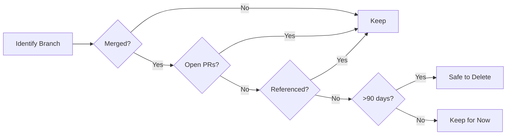

# Repository Cleanup Safeguards and Process Guide

**Purpose**: Ensure safe, reversible, and well-documented cleanup of repository branches, releases, and artifacts  
**Audience**: Repository maintainers, contributors, and administrators  
**Version**: 1.0.0

---

## Table of Contents

1. [Overview](#overview)
2. [Safeguard Principles](#safeguard-principles)
3. [Pre-Cleanup Requirements](#pre-cleanup-requirements)
4. [Cleanup Process](#cleanup-process)
5. [Emergency Procedures](#emergency-procedures)
6. [Automation Safety](#automation-safety)
7. [Verification Procedures](#verification-procedures)

---

## Overview

This document outlines the safeguards and procedures for safely cleaning up the pi-forge-quantum-genesis repository while preventing accidental deletion of active development assets.

### Core Principle

**"Measure twice, cut once, and keep the tape measure handy."**

Every cleanup action must be:
- ✅ **Documented**: Record what, why, when, and who
- ✅ **Reversible**: Maintain ability to restore deleted items
- ✅ **Verified**: Confirm safety before execution
- ✅ **Automated**: Use automation with manual oversight
- ✅ **Gradual**: Incremental cleanup, not wholesale deletion

---

## Safeguard Principles

### 1. Never Delete Without Verification



### 2. Multi-Layer Protection

#### Layer 1: Automated Checks
- Branch age verification
- PR status checking
- Reference scanning
- Protection rule enforcement

#### Layer 2: Manual Review
- Maintainer approval for bulk deletions
- Team notification for long-lived branches
- Documentation review before cleanup

#### Layer 3: Recovery Capability
- 30-day soft-delete period (GitHub)
- Git reflog retention (90 days)
- Backup documentation
- Restoration procedures

### 3. Transparency and Communication

Every cleanup action must be:
- Announced in advance (for bulk operations)
- Logged in workflow runs
- Summarized in reports
- Available for audit

---

## Pre-Cleanup Requirements

### Required Information Gathering

Before initiating any cleanup, collect:

#### 1. Branch Inventory

```bash
# Create comprehensive branch report
cat > /tmp/branch-inventory.sh << 'EOF'
#!/bin/bash

echo "Branch Inventory Report - $(date)"
echo "=================================="
echo

echo "Total Branches:"
git branch -r | grep -v HEAD | wc -l

echo
echo "Branches by Pattern:"
echo "  copilot/*: $(git branch -r | grep -c 'copilot/')"
echo "  main: 1"
echo "  other: $(git branch -r | grep -v 'copilot/' | grep -v 'main' | grep -v HEAD | wc -l)"

echo
echo "Recent Activity (last 30 days):"
git for-each-ref --sort=-committerdate refs/remotes/origin \
  --format='%(refname:short)|%(committerdate:short)|%(subject)' \
  | awk -F'|' '{
      split($2, d, "-")
      if (d[1] >= 2026 && d[2] >= 1 && d[3] >= 9) print $0
    }' \
  | wc -l

echo
echo "Oldest 10 Branches:"
git for-each-ref --sort=committerdate refs/remotes/origin \
  --format='%(refname:short)|%(committerdate:short)|%(subject)' \
  | head -10
EOF

chmod +x /tmp/branch-inventory.sh
/tmp/branch-inventory.sh
```

#### 2. PR Status Check

```bash
# List all open PRs with their branches
gh pr list --state open --json number,title,headRefName,updatedAt \
  --jq '.[] | "\(.number)|\(.headRefName)|\(.updatedAt)|\(.title)"' \
  > open-prs.txt

# List recently closed PRs
gh pr list --state closed --limit 50 --json number,title,headRefName,mergedAt \
  --jq '.[] | "\(.number)|\(.headRefName)|\(.mergedAt)|\(.title)"' \
  > closed-prs.txt
```

#### 3. Workflow Dependency Scan

```bash
# Scan all workflows for branch references
echo "Workflow Branch References:"
for file in .github/workflows/*.yml; do
  echo "=== $file ==="
  grep -n "branch\|ref" "$file" | grep -v "^#"
done > workflow-refs.txt
```

#### 4. Documentation References

```bash
# Search documentation for branch references
find . -name "*.md" -type f -exec grep -l "copilot/" {} \; > doc-refs.txt
```

### Pre-Cleanup Checklist

Complete this checklist before any cleanup action:

- [ ] Branch inventory generated
- [ ] Open PR list exported
- [ ] Workflow dependencies scanned
- [ ] Documentation references checked
- [ ] Team notification sent (for bulk cleanup)
- [ ] Backup created
- [ ] Dry-run executed successfully
- [ ] Review period completed (24-48 hours minimum)
- [ ] Approval obtained (for >10 branches)

---

## Cleanup Process

### Process 1: Automated Safe Cleanup (Recommended)

**Use Case**: Regular maintenance, branches >90 days old

#### Step 1: Dry Run

```bash
# Execute dry-run mode
gh workflow run branch-cleanup.yml -f dry_run=true

# Wait for completion (5-10 minutes)
sleep 300

# View results
gh run list --workflow=branch-cleanup.yml --limit 1
gh run view --log
```

#### Step 2: Review Output

Check the workflow summary for:
- Number of branches to be deleted
- Branch names and last activity dates
- Any skipped branches (with reasons)
- Errors or warnings

#### Step 3: Verify Safety

```bash
# For each branch in deletion list, verify:
# 1. No open PRs
gh pr list --state open --search "head:BRANCH_NAME"

# 2. Not referenced in issues
gh issue list --search "BRANCH_NAME"

# 3. Not in documentation
grep -r "BRANCH_NAME" docs/ wiki/ README.md
```

#### Step 4: Execute Cleanup

```bash
# If dry-run looks good, execute real cleanup
gh workflow run branch-cleanup.yml -f dry_run=false

# Monitor execution
watch -n 10 'gh run list --workflow=branch-cleanup.yml --limit 1'
```

#### Step 5: Post-Cleanup Verification

```bash
# Verify expected results
git fetch --prune

# Count remaining branches
git branch -r | wc -l

# Check for any unexpected deletions
git for-each-ref --format='%(refname:short)' refs/remotes/origin
```

### Process 2: Manual Targeted Cleanup

**Use Case**: Specific branches that need immediate cleanup

#### Step 1: Identify Target Branch

```bash
# Get branch details
BRANCH="copilot/specific-branch"
git log -1 origin/$BRANCH --format="%H|%an|%ad|%s"
```

#### Step 2: Verification Checks

```bash
# Check if merged
git branch -r --merged main | grep "$BRANCH"

# Check for open PRs
gh pr list --state open --head "$BRANCH"

# Check for references
grep -r "$BRANCH" .github/ docs/ wiki/ README.md
```

#### Step 3: Create Safety Record

```bash
# Document the deletion
cat >> branch-deletions.log << EOF
Date: $(date -u +"%Y-%m-%d %H:%M:%S UTC")
Branch: $BRANCH
Last Commit: $(git rev-parse origin/$BRANCH)
Reason: [YOUR REASON HERE]
Verified By: [YOUR NAME]
EOF
```

#### Step 4: Execute Deletion

```bash
# Delete the branch
git push origin --delete "$BRANCH"

# Verify deletion
git branch -r | grep "$BRANCH" || echo "Successfully deleted"
```

### Process 3: Bulk Manual Cleanup

**Use Case**: Multiple specific branches need cleanup

#### Step 1: Create Branch List

```bash
# List branches to delete
cat > branches-to-delete.txt << EOF
copilot/old-feature-1
copilot/old-feature-2
copilot/merged-fix-3
EOF
```

#### Step 2: Automated Verification

```bash
# Verify each branch
cat > /tmp/verify-branches.sh << 'EOF'
#!/bin/bash

while IFS= read -r branch; do
  echo "=== Verifying: $branch ==="
  
  # Check if merged
  if git branch -r --merged main | grep -q "origin/$branch"; then
    echo "✓ Merged to main"
  else
    echo "✗ NOT merged to main - SKIP"
    continue
  fi
  
  # Check for open PRs
  PR_COUNT=$(gh pr list --state open --head "$branch" --json number --jq 'length')
  if [ "$PR_COUNT" -gt 0 ]; then
    echo "✗ Has $PR_COUNT open PR(s) - SKIP"
    continue
  fi
  echo "✓ No open PRs"
  
  # Get age
  LAST_COMMIT=$(git log -1 --format=%ct "origin/$branch" 2>/dev/null)
  CURRENT=$(date +%s)
  AGE_DAYS=$(( (CURRENT - LAST_COMMIT) / 86400 ))
  echo "✓ Age: $AGE_DAYS days"
  
  if [ "$AGE_DAYS" -ge 90 ]; then
    echo "✓✓ SAFE TO DELETE"
  else
    echo "⚠️  Less than 90 days old - consider keeping"
  fi
  
  echo
done < branches-to-delete.txt
EOF

chmod +x /tmp/verify-branches.sh
/tmp/verify-branches.sh
```

#### Step 3: Execute with Confirmation

```bash
# Delete with confirmation prompt
cat > /tmp/delete-branches.sh << 'EOF'
#!/bin/bash

while IFS= read -r branch; do
  echo "Delete $branch? (y/n/q to quit)"
  read -r answer
  
  case $answer in
    y|Y)
      echo "Deleting $branch..."
      git push origin --delete "$branch"
      echo "$(date -u) | $branch | $(git rev-parse origin/$branch 2>/dev/null || echo 'DELETED')" >> deletions.log
      ;;
    q|Q)
      echo "Quit requested. Stopping."
      exit 0
      ;;
    *)
      echo "Skipping $branch"
      ;;
  esac
done < branches-to-delete.txt
EOF

chmod +x /tmp/delete-branches.sh
/tmp/delete-branches.sh
```

---

## Emergency Procedures

### Scenario 1: Critical Branch Accidentally Deleted

#### Immediate Response (Within 24 Hours)

```bash
# Option 1: Restore via GitHub UI
# 1. Go to repository on GitHub
# 2. Click "branches" tab
# 3. Click "Deleted branches"
# 4. Click "Restore" next to the branch

# Option 2: Restore via Git
# Find the last commit of the deleted branch
git reflog --all | grep "branch-name"

# Recreate the branch
git checkout -b branch-name <commit-sha>
git push origin branch-name
```

#### If Commit SHA is Unknown

```bash
# Search in workflow logs
gh run list --workflow=branch-cleanup.yml --limit 10
gh run view <run-id> --log | grep "branch-name"

# Check email notifications
# GitHub sends notifications for force pushes/deletions

# Contact GitHub support (last resort)
# If >24 hours and not in reflog, contact GitHub support
```

### Scenario 2: Bulk Deletion Gone Wrong

#### Stop the Workflow

```bash
# Cancel running workflow
gh run list --workflow=branch-cleanup.yml --limit 1 --json databaseId --jq '.[0].databaseId' \
  | xargs -I {} gh run cancel {}
```

#### Assess Damage

```bash
# Check deletion log
gh run view --log | grep "Deleting:"

# Compare with pre-cleanup backup
diff branch-backup.txt <(git branch -r)
```

#### Restore All Deleted Branches

```bash
# If within 24 hours and commits are in reflog
git reflog --all --since="24 hours ago" | grep "branch"

# Use GitHub UI to restore multiple branches
# Repository > Branches > Deleted branches > Restore each
```

### Scenario 3: Workflow Broken After Cleanup

#### Identify Failed Workflow

```bash
# Check recent workflow runs
gh run list --limit 20 --json status,name,conclusion \
  --jq '.[] | select(.conclusion == "failure") | "\(.name): \(.status)"'
```

#### Diagnose the Issue

```bash
# Check workflow logs
gh run view <run-id> --log

# Look for missing branch references
grep -n "branch" <failed-workflow-file>
```

#### Fix the Issue

```bash
# Option 1: Update workflow to use correct branch
# Edit .github/workflows/<workflow>.yml
# Change branch reference to 'main' or appropriate branch

# Option 2: Restore the referenced branch
# Use emergency restore procedures above

# Option 3: Disable workflow temporarily
# Rename file: mv workflow.yml workflow.yml.disabled
```

---

## Automation Safety

### Automated Workflow Safeguards

The existing `branch-cleanup.yml` workflow includes:

#### Built-in Protections

1. **Protected Branch List**
   ```yaml
   PROTECTED_BRANCHES="main|master|develop|staging|production"
   ```

2. **Open PR Check**
   ```bash
   gh pr list --state open --head "$branch"
   ```

3. **Age Requirement**
   ```bash
   AGE_DAYS >= 90
   ```

4. **Dry Run Default**
   ```yaml
   dry_run: 'true'
   ```

### Enhanced Safety Measures

#### Recommendation 1: Add Notification Step

```yaml
# Add to branch-cleanup.yml
- name: Notify team
  if: ${{ github.event.inputs.dry_run == 'false' }}
  uses: actions/github-script@v7
  with:
    script: |
      github.rest.issues.create({
        owner: context.repo.owner,
        repo: context.repo.repo,
        title: '🧹 Automated Branch Cleanup Executed',
        body: 'Branch cleanup workflow has deleted inactive branches. Check the workflow run for details.',
        labels: ['maintenance', 'automated']
      });
```

#### Recommendation 2: Add Branch Backup

```yaml
# Add to branch-cleanup.yml before deletion
- name: Backup branch references
  run: |
    mkdir -p backups
    git for-each-ref --format='%(refname:short)|%(objectname)|%(committerdate:iso8601)' \
      refs/remotes/origin > backups/branches-$(date +%Y%m%d-%H%M%S).txt
    
    # Keep last 10 backups
    ls -t backups/branches-*.txt | tail -n +11 | xargs -r rm
```

#### Recommendation 3: Add Slack/Discord Notification

```yaml
# Add to branch-cleanup.yml
- name: Send notification
  if: always()
  env:
    WEBHOOK_URL: ${{ secrets.CLEANUP_WEBHOOK_URL }}
  run: |
    curl -X POST "$WEBHOOK_URL" \
      -H 'Content-Type: application/json' \
      -d '{
        "text": "Branch cleanup completed. Deleted: '$DELETED_COUNT' branches. Check workflow logs for details.",
        "username": "Branch Cleanup Bot"
      }'
```

### Workflow Testing Procedures

Before modifying automation:

```bash
# 1. Create test branch
git checkout -b test/cleanup-automation
git push origin test/cleanup-automation

# 2. Test workflow on test branch
gh workflow run branch-cleanup.yml -f dry_run=true

# 3. Verify test branch is handled correctly
gh run view --log | grep "test/cleanup-automation"

# 4. Clean up test branch
git push origin --delete test/cleanup-automation
```

---

## Verification Procedures

### Post-Cleanup Verification Checklist

After any cleanup operation:

#### Immediate Verification (Within 1 Hour)

- [ ] Count remaining branches matches expectation
- [ ] All critical workflows still passing
- [ ] No broken documentation links
- [ ] No missing references in code

```bash
# Verify branch count
echo "Expected: [NUMBER]"
echo "Actual: $(git branch -r | grep -v HEAD | wc -l)"

# Check workflow status
gh run list --limit 5 --json status,conclusion

# Check for broken links in docs
find docs wiki -name "*.md" -exec grep -l "copilot/" {} \;
```

#### Short-term Verification (Within 24 Hours)

- [ ] All deployments successful
- [ ] No issues reported by team
- [ ] Automated tests passing
- [ ] No unexpected errors in logs

```bash
# Check deployment status
gh workflow run deploy-vercel.yml
gh workflow run test-and-build.yml

# Review application logs
# (Check Railway, Render, Vercel logs)
```

#### Long-term Verification (Within 1 Week)

- [ ] No requests to restore deleted branches
- [ ] Team comfortable with new branch count
- [ ] Automation continues to work properly
- [ ] Documentation updated

### Continuous Monitoring

#### Daily Checks

```bash
# Branch count trending
git branch -r | grep -v HEAD | wc -l >> metrics/daily-branch-count.txt

# Workflow health
gh run list --limit 1 --json conclusion | jq -r '.[0].conclusion'
```

#### Weekly Reports

```bash
# Generate weekly cleanup report
cat > /tmp/weekly-report.sh << 'EOF'
#!/bin/bash

echo "Weekly Cleanup Report - $(date +%Y-%m-%d)"
echo "========================================"
echo
echo "Branch Statistics:"
echo "  Total branches: $(git branch -r | grep -v HEAD | wc -l)"
echo "  Branches >90 days: $(git for-each-ref --sort=committerdate refs/remotes/origin --format='%(committerdate:unix)' | awk -v now=$(date +%s) '$1 < (now - 7776000) {count++} END {print count+0}')"
echo
echo "PR Statistics:"
echo "  Open PRs: $(gh pr list --state open --json number --jq 'length')"
echo "  Stale PRs (>14 days): $(gh pr list --state open --json number,updatedAt --jq '[.[] | select((.updatedAt | fromdateiso8601) < (now - 1209600))] | length')"
echo
echo "Workflow Health:"
gh run list --limit 10 --json status,conclusion | jq -r '[.[] | .conclusion] | group_by(.) | map({conclusion: .[0], count: length}) | .[]'
EOF

chmod +x /tmp/weekly-report.sh
/tmp/weekly-report.sh
```

---

## Appendix

### A. Useful Git Commands

```bash
# Find branches not merged to main
git branch -r --no-merged main

# Find branches merged to main
git branch -r --merged main | grep -v "main"

# Count commits on a branch not in main
git rev-list --count main..origin/branch-name

# Check if a branch exists
git rev-parse --verify origin/branch-name

# Find when a branch was created
git reflog show --date=iso origin/branch-name | tail -1

# List branches by author
git for-each-ref --format='%(authorname)|%(refname:short)' refs/remotes/origin \
  | sort | uniq -c
```

### B. GitHub CLI Commands

```bash
# List all PRs for a specific branch
gh pr list --head branch-name --state all

# View PR details
gh pr view PR_NUMBER

# Check branch protection status
gh api repos/OWNER/REPO/branches/BRANCH/protection

# Search issues mentioning a branch
gh issue list --search "branch-name"

# View repository insights
gh repo view --web
```

### C. Recovery Contact Information

If you need help recovering deleted branches or resolving issues:

1. **Repository Maintainers**: Check CONTRIBUTORS.md
2. **GitHub Support**: https://support.github.com
3. **Emergency Contacts**: [Define for your organization]

### D. Version History

| Version | Date | Changes | Author |
|---------|------|---------|--------|
| 1.0.0 | 2026-02-08 | Initial version | Copilot Agent |

---

**Remember**: When in doubt, don't delete. It's always better to keep a branch too long than to lose work accidentally.
