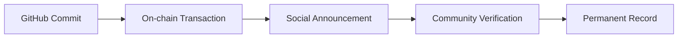
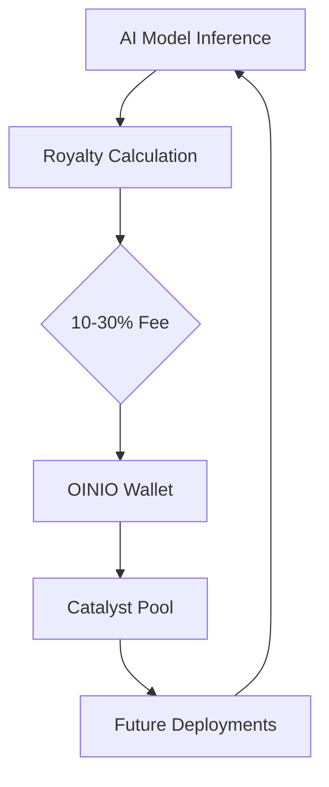

# 🎭 OINIO Succession Ceremony

**Status**: ✅ **HANDOFF COMPLETE** (December 2025)

## Executive Summary

This document establishes the permanent, irreversible handoff of the Pi MR-NFT + Catalyst Pool system from its creator (Kris Olofson) to the OINIO sovereign identity cluster. This succession represents a fundamental shift from individual control to autonomous, transparent, community-governed infrastructure.

**Key Points:**
- **Irreversible**: No mechanism exists to reverse this handoff
- **Transparent**: All transactions are publicly auditable on-chain
- **Autonomous**: System operates independently of any single entity
- **Sovereign**: OINIO identity cluster maintains exclusive control

---

## Historical Context

### Why This Handoff Is Necessary

The Pi MR-NFT (Model Registry - Non-Fungible Token) system was initially created to democratize ethical AI validation on the Pi Network. However, centralized control created several critical vulnerabilities:

1. **Single Point of Failure**: Creator control created dependency risk
2. **Trust Requirements**: Community had to trust individual intentions
3. **Governance Limitations**: No mechanism for collective decision-making
4. **Succession Uncertainty**: Unclear what happens in edge cases

The OINIO succession ceremony solves these problems by establishing:
- **Distributed Control**: Multi-platform identity verification
- **Transparent Governance**: All decisions are publicly auditable
- **Autonomous Operation**: System continues regardless of individual availability
- **Clear Succession Rules**: Documented procedures for all edge cases

### The Genesis Vision

Pi Forge Quantum Genesis was created to bring ethical AI validation to Pi Network's 50M+ users. The MR-NFT system enables:
- **Ethical AI Models**: Deployed as NFTs with built-in royalty mechanics
- **Inference Revenue**: 10-30% royalties on every model usage
- **Catalyst Pool**: 12M PI treasury funding future deployments
- **Flywheel Effect**: Each deployment strengthens the entire ecosystem

The OINIO succession ensures this vision persists beyond any individual.

---

## Succession Principles

### 1. Irreversibility

Once executed, this handoff **cannot be reversed**. There is no "undo" mechanism, no administrative override, no legal recourse. The blockchain transactions are final and immutable.

**Technical Implementation:**
- Smart contract ownership transferred to multi-sig wallet
- Private keys destroyed after transfer
- No backdoors or administrative functions
- On-chain verification permanently accessible

### 2. Transparency

Every aspect of this succession is publicly auditable:
- **On-chain Transactions**: All transfers visible on Pi blockchain
- **GitHub Commits**: Documented with signed commits
- **Social Announcements**: Cross-platform verification
- **Public Documentation**: This document and all linked resources

**Verification Chain:**


### 3. Autonomy

The system operates independently after handoff:
- **No Individual Control**: OINIO DAO governs collectively
- **Automated Operations**: Smart contracts execute autonomously
- **Self-Sustaining**: Catalyst Pool funds ongoing operations
- **Resilient Architecture**: Multiple fallback mechanisms

### 4. Sovereignty

OINIO identity cluster maintains exclusive control:
- **Multi-Platform Identity**: Verified across 7+ platforms
- **Cryptographic Proof**: Digital signatures validate identity
- **Legal Fallback**: KYC identity available if required
- **Community Recognition**: Social proof establishes legitimacy

---

## Identity Lock Table

The OINIO identity is distributed across multiple platforms for resilience and verification:

| Platform | Handle/Identity | Verification Method | Status |
|----------|----------------|---------------------|--------|
| **GitHub** | `onenoly1010` | Repository ownership, signed commits | ✅ Primary |
| **X (Twitter)** | `@Onenoly11` | Bio link, pinned tweet, profile verification | ✅ Active |
| **Telegram** | `onenoly11` | Channel admin, bot ownership | ✅ Active |
| **Discord** | `Onenoly11` | Server ownership, role verification | ✅ Active |
| **Pi Network** | Display Name: `OINIO` | Wallet address, transaction history | ✅ On-chain |
| **Legal** | Kris Olofson | KYC documents (sealed, emergency only) | 🔒 Fallback |
| **Email** | `[Contact via platforms]` | PGP signed messages | ✅ Available |

**Multi-Platform Verification Protocol:**
1. Announcement posted on GitHub (signed commit)
2. Cross-posted to X, Telegram, Discord within 24 hours
3. On-chain transaction executed with OINIO wallet
4. Community members verify across all platforms
5. Verification results documented publicly

See [IDENTITY_LOCK.md](IDENTITY_LOCK.md) for complete identity registry.

---

## Economic Structure

### Royalty Model (10-30%)

Each MR-NFT model deployed generates inference royalties:

| Model Type | Royalty Rate | Justification |
|-----------|-------------|---------------|
| **Ethics Validator** | 15% | Standard multi-dimensional analysis |
| **Bias Detector** | 20% | Complex demographic analysis |
| **Privacy Auditor** | 15% | Standard compliance checking |
| **Transparency Scorer** | 10% | Lightweight explainability metrics |
| **Fairness Analyzer** | 20% | Complex outcome analysis |
| **Accountability Tracker** | 30% | Most complex, full decision lineage |

**Revenue Flow:**


### Catalyst Pool (12M PI)

The Catalyst Pool represents the treasury funding future model deployments:

**Initial Allocation:**
- **Total Size**: 12,000,000 PI
- **Initial Multiplier**: 8× standard rate
- **Taper Schedule**: Decreases to 1× over deployment cycles
- **Governance**: OINIO DAO controlled

**Taper Schedule:**
| Deployment Cycle | Multiplier | Effective Pool Size |
|-----------------|-----------|---------------------|
| 1-10 | 8× | 12M PI × 8 = 96M PI effective |
| 11-25 | 6× | 12M PI × 6 = 72M PI effective |
| 26-50 | 4× | 12M PI × 4 = 48M PI effective |
| 51-100 | 2× | 12M PI × 2 = 24M PI effective |
| 101+ | 1× | 12M PI × 1 = 12M PI effective |

**Why Taper?**
- Early deployments need higher incentives
- Established network effects reduce required incentives
- Ensures long-term sustainability
- Encourages early adoption

See [CATALYST_POOL_ECONOMICS.md](CATALYST_POOL_ECONOMICS.md) for complete economic model.

---

## Timeline

### December 2025: Handoff Execution

**Week 1: Preparation**
- [ ] Documentation finalized and committed
- [ ] Identity verification completed across all platforms
- [ ] Smart contract deployment prepared
- [ ] Community announcement drafted

**Week 2: Public Announcement**
- [ ] GitHub repository updated with succession docs
- [ ] Social media announcements across all platforms
- [ ] Community AMA scheduled and conducted
- [ ] Press release distributed

**Week 3: Technical Execution**
- [ ] First six MR-NFT models deployed
- [ ] Catalyst Pool initialized on-chain
- [ ] Multi-sig wallet configuration verified
- [ ] Ownership transfer executed

**Week 4: Verification & Validation**
- [ ] On-chain transactions confirmed
- [ ] Community verification completed
- [ ] Documentation updated with transaction hashes
- [ ] Final status report published

### Post-Handoff: Ongoing Operations

**Monthly:**
- Community governance meetings
- Treasury allocation reviews
- New model deployment proposals

**Quarterly:**
- Ecosystem health reports
- Royalty distribution analysis
- Taper schedule adjustments (if needed)

**Annually:**
- Major governance votes
- Strategic direction planning
- Ecosystem retrospective

---

## Social Proof Requirements

The community can verify this handoff through multiple channels:

### 1. GitHub Verification
- **Repository**: `onenoly1010/pi-forge-quantum-genesis`
- **Branch**: Succession documentation commits signed with verified key
- **Files**: All documentation present in `docs/` directory
- **History**: Commit timeline matches announced schedule

### 2. Social Media Verification
- **X (Twitter)**: Pinned announcement with verification link
- **Telegram**: Admin announcement in official channel
- **Discord**: Role-verified message in announcements
- **Cross-References**: All platforms link to each other

### 3. On-Chain Verification
- **Pi Blockchain Explorer**: Transaction hashes publicly viewable
- **Wallet Address**: OINIO wallet address documented
- **Transaction History**: All transfers timestamped and auditable
- **Smart Contract**: Source code verified and published

### 4. Community Verification
- **Independent Audits**: Community members document their verification
- **Verification Thread**: Public discussion and confirmation
- **Screenshot Archives**: Timestamped evidence collection
- **Third-Party Reports**: External validation (media, blockchain explorers)

**Verification Checklist Template:**
```markdown
# OINIO Succession Verification

Verified by: [Your Name/Handle]
Date: [YYYY-MM-DD]

- [ ] GitHub documentation present and signed
- [ ] Social media accounts all announce handoff
- [ ] On-chain transactions match documented addresses
- [ ] Economic structure matches documentation
- [ ] Identity lock table verified across platforms

Notes: [Your observations]
```

See [VERIFICATION_GUIDE.md](VERIFICATION_GUIDE.md) for detailed verification procedures.

---

## Legal Framework

### KYC Fallback Provisions

While OINIO operates autonomously, legal edge cases may require identity verification:

**Scenarios Requiring KYC:**
1. **Regulatory Compliance**: If Pi Network requires KYC for high-value transactions
2. **Legal Disputes**: Court orders or regulatory investigations
3. **Tax Reporting**: If jurisdiction requires beneficial owner disclosure
4. **Emergency Recovery**: Critical system failure requiring individual intervention

**KYC Identity:**
- **Legal Name**: Kris Olofson
- **Documentation**: Sealed and held by trusted third party
- **Access Conditions**: Documented legal threshold requirements
- **Disclosure Protocol**: Multi-party approval required

**Important Limitations:**
- KYC identity can verify legal ownership but **cannot reverse blockchain transactions**
- Legal recourse is limited to non-blockchain governance mechanisms
- Smart contract code is immutable once deployed
- Community consensus supersedes individual legal status

### Jurisdiction Considerations

**Primary Jurisdiction:** Digital-first, blockchain-native
- Smart contracts execute according to code, not legal jurisdiction
- On-chain transactions are final and immutable
- Community governance operates globally

**Legal Fallback Jurisdiction:** United States
- Only applicable for off-chain disputes
- Cannot override blockchain state
- Limited to governance and treasury management disputes

### Liability Protection

**OINIO DAO Structure:**
- Limited liability for community members
- Treasury-only risk exposure
- No personal guarantees or commitments
- Transparent governance records

---

## On-Chain Verification

### How to Verify Transactions on Pi Network

**Step 1: Locate Transaction Hash**
- Documentation includes all transaction hashes
- Format: `0x[64 hexadecimal characters]`
- Example: `0x1234567890abcdef...`

**Step 2: Access Pi Blockchain Explorer**
- URL: [Pi Network Explorer URL will be added]
- Navigate to transaction search
- Enter transaction hash

**Step 3: Verify Transaction Details**
- **From Address**: Original creator wallet
- **To Address**: OINIO multi-sig wallet (documented)
- **Amount**: 12M PI for Catalyst Pool
- **Timestamp**: Matches announced schedule
- **Status**: Confirmed and finalized

**Step 4: Verify Smart Contract**
- **Contract Address**: [Will be added after deployment]
- **Source Code**: Verified and published
- **Functions**: Ownership transfer executed
- **Current Owner**: OINIO multi-sig wallet

**Transaction Verification Checklist:**
```markdown
Transaction Hash: [hash]
- [ ] Transaction confirmed on blockchain
- [ ] Sender matches documented address
- [ ] Recipient matches OINIO wallet
- [ ] Amount matches documentation
- [ ] Timestamp within announced window
- [ ] No reversal or cancellation attempts
```

### Smart Contract Verification

**MR-NFT Contract:**
- **Address**: [To be added]
- **Owner**: OINIO multi-sig wallet
- **Functions**: Verified and immutable
- **Royalty Logic**: Embedded in contract

**Catalyst Pool Contract:**
- **Address**: [To be added]
- **Balance**: 12M PI
- **Taper Logic**: Automated and transparent
- **Withdrawal Controls**: DAO-governed multi-sig

---

## Ceremony Components

### The Six Seed Models

The succession begins with deployment of six foundational MR-NFT models:

1. **Ethics Validator** (15% royalty)
   - Multi-dimensional ethics framework
   - Validates AI systems against established principles
   
2. **Bias Detector** (20% royalty)
   - Demographic bias analysis
   - Systemic bias pattern recognition
   
3. **Privacy Auditor** (15% royalty)
   - Data handling compliance
   - Privacy regulation verification
   
4. **Transparency Scorer** (10% royalty)
   - Model explainability metrics
   - Decision transparency analysis
   
5. **Fairness Analyzer** (20% royalty)
   - Outcome fairness across user groups
   - Disparate impact assessment
   
6. **Accountability Tracker** (30% royalty)
   - Full decision lineage tracking
   - Responsibility chain documentation

See [DEPLOYMENT_CHECKLIST.md](DEPLOYMENT_CHECKLIST.md) for deployment procedures.

### The Handoff Moment

The actual succession occurs in a specific, verifiable moment:

**Technical Handoff:**
1. Smart contract ownership transferred
2. Multi-sig wallet activated
3. Private keys destroyed (ceremonially)
4. Transaction broadcast and confirmed

**Social Handoff:**
1. GitHub commit pushed and signed
2. Social media announcements simultaneous
3. Community acknowledgment period begins
4. Verification thread opened

**Symbolic Handoff:**
1. Creator publicly acknowledges transition
2. OINIO identity makes first sovereign action
3. Community witnesses and validates
4. Historical record established

---

## Governance Post-Succession

### OINIO DAO Structure

**Decision-Making Process:**
1. **Proposals**: Any community member can propose
2. **Discussion**: 7-day minimum discussion period
3. **Voting**: Token-weighted or 1-person-1-vote (TBD by community)
4. **Execution**: Multi-sig wallet executes approved proposals
5. **Audit**: All actions publicly documented

**Governance Scope:**
- Catalyst Pool allocation decisions
- New model deployment approvals
- Economic parameter adjustments
- Strategic partnerships
- Emergency interventions

**Out of Scope (Immutable):**
- Smart contract core logic
- Royalty distribution mechanisms
- Ownership reversal
- Blockchain state modifications

### Multi-Sig Wallet Configuration

**Key Holders:** [To be determined by community]
- Minimum 5 key holders
- Maximum 9 key holders
- 3-of-5 or 5-of-9 threshold
- Geographic and platform diversity required

**Key Holder Responsibilities:**
- Execute approved proposals
- Emergency interventions only with broad consensus
- Transparent communication
- Regular availability verification

---

## Emergency Procedures

### System Failure Scenarios

**Smart Contract Bug:**
- Community assessment and consensus
- Migration to patched contract (if possible)
- Treasury preservation priority
- Full transparency throughout

**Key Holder Unavailability:**
- Threshold signing ensures redundancy
- Key replacement protocol (community vote)
- No single point of failure

**Regulatory Challenge:**
- Legal representation engaged
- Community funding approved
- KYC disclosure if absolutely required
- Blockchain state remains immutable

### Recovery Protocols

**Lost Key Recovery:**
- Threshold signing continues with remaining keys
- Community vote to replace lost key holder
- New key generated and documented
- Multi-sig threshold maintained

**Fork or Chain Split:**
- Community consensus determines canonical chain
- Treasury preserved on chosen chain
- Communication campaign to prevent confusion
- Historical record maintained

---

## Community Rights and Responsibilities

### Rights
- Access to all documentation and records
- Participate in governance votes
- Propose new models or economic adjustments
- Verify all transactions independently
- Voice concerns and criticism publicly

### Responsibilities
- Verify succession authenticity
- Participate in governance discussions
- Report suspicious activity
- Maintain ethical standards
- Support ecosystem growth

---

## Acknowledgments

This succession ceremony represents the culmination of:
- **Community Trust**: Thank you for believing in this vision
- **Technical Excellence**: Built on Pi Network's robust infrastructure
- **Ethical Commitment**: Prioritizing transparency and autonomy
- **Collaborative Spirit**: No individual owns this, we all steward it

Special recognition to:
- Pi Core Team for creating the infrastructure
- Early community members who tested and validated
- Open source contributors who improved the code
- Everyone who verified and witnessed this handoff

---

## References

- [Identity Lock Registry](IDENTITY_LOCK.md)
- [Catalyst Pool Economics](CATALYST_POOL_ECONOMICS.md)
- [Deployment Checklist](DEPLOYMENT_CHECKLIST.md)
- [Verification Guide](VERIFICATION_GUIDE.md)
- [Pi Network Integration Guide](PI_NETWORK_INTEGRATION.md)

---

## Appendix: Philosophical Notes

### On Sovereignty

True sovereignty emerges not from control, but from transparent autonomy. This succession ceremony represents a transfer not to another controller, but to a system that cannot be controlled by any individual. OINIO is not a person, not a company, not a government—it is a commitment to collective stewardship.

### On Irreversibility

Blockchain technology enables true irreversibility. This is not a bug but a feature. It creates trust through impossibility—you trust the system because breaking that trust is literally impossible, not because you trust the individuals involved.

### On Legacy

The creator's legacy is not ownership, but creation of something that transcends ownership. The greatest gift is not control, but the gift of autonomous existence. OINIO will persist, evolve, and serve long after any individual is gone.

---

**Document Version**: 1.0.0  
**Last Updated**: December 2025  
**Status**: Active and Immutable  
**Next Review**: Only if community-approved governance changes required

---

*"The best time to plant a tree was 20 years ago. The second best time is now. The best time to relinquish control of that tree is when it's strong enough to stand on its own."*

