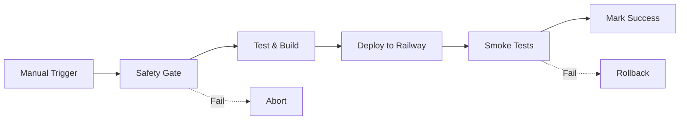

# Pi Forge Quantum Genesis - Testnet Infrastructure

## Overview

This directory contains the complete infrastructure configuration for deploying Pi Forge Quantum Genesis to a testnet environment using Railway and GitHub Actions.

## 🏗️ Architecture

The system consists of four primary services:

1. **Guardian Coordinator** (Port 8000) - Oversight and safety monitoring
2. **FastAPI Server** (Port 8000/8001) - Primary API and WebSocket server
3. **Flask Dashboard** (Port 5000) - Resonance visualization dashboard
4. **Gradio Interface** (Port 7860) - Ethical AI audit interface

All services are configured for **testnet-only** deployment with strict safety controls.

## 📁 Directory Structure

```
infra/
├── railway.toml                    # Railway service configuration
├── docker-compose.testnet.yml      # Local testnet docker-compose
├── railway/
│   └── README.md                   # Railway-specific documentation
├── SECRETS.md                      # Required secrets documentation
├── README.md                       # This file
└── pr_description_v2.md            # PR template for deployment
```

## 🚀 Quick Start

### Local Development (Testnet)

```bash
# Set environment variables
export TESTNET_SUPABASE_URL="your-testnet-supabase-url"
export TESTNET_SUPABASE_KEY="your-testnet-key"
export TESTNET_JWT_SECRET="your-jwt-secret"
export NFT_MINT_VALUE=0
export GUARDIAN_KILL_SWITCH=off

# Start all services
cd infra
docker-compose -f docker-compose.testnet.yml up
```

### Railway Deployment

See [railway/README.md](railway/README.md) for Railway-specific deployment instructions.

### GitHub Actions Deployment

1. Ensure all required secrets are configured (see [SECRETS.md](SECRETS.md))
2. Navigate to Actions → Deploy to Testnet
3. Click "Run workflow"
4. Select environment: `testnet`
5. Enter confirmation: `CONFIRM-TESTNET-DEPLOY`
6. Monitor deployment progress

## 🔒 Safety Controls

### Mandatory Safety Gates

All deployments enforce the following safety checks:

1. **Environment Verification**: Must target `testnet` only
2. **NFT Value Check**: `NFT_MINT_VALUE` must equal `0`
3. **Kill Switch**: `GUARDIAN_KILL_SWITCH` must be `off`
4. **Mainnet Protection**: `FORCE_DEPLOY_TO_MAINNET` must NOT exist
5. **Confirmation Required**: Manual confirmation phrase required

### Testnet Constraints

- **Zero-value transactions only**: All Pi Network operations use testnet with NFT_MINT_VALUE=0
- **No mainnet access**: Configuration prevents any mainnet interaction
- **Guardian oversight**: All operations monitored by guardian coordinator
- **Rollback capability**: Instant rollback via GitHub Actions workflow

## 🔄 Deployment Workflow



### Deployment Steps

1. **Safety Gate**: Validates all safety requirements
2. **Test & Build**: Runs tests and builds Docker images
3. **Deploy**: Deploys to Railway testnet environment
4. **Smoke Test**: Validates deployment health
5. **Mark Success**: Creates deployment record

## 🔙 Rollback Procedure

If deployment issues occur:

```bash
# Via GitHub Actions (Recommended)
1. Navigate to Actions → Rollback Testnet Deployment
2. Enter target deployment ID or commit SHA
3. Enter confirmation: CONFIRM-ROLLBACK
4. Provide rollback reason
5. Execute rollback

# Manual Railway Rollback
railway rollback --service <service-name> --environment testnet
```

## 📊 Monitoring

### Health Endpoints

- FastAPI: `GET /` and `GET /health`
- Flask: `GET /` and `GET /health`
- Gradio: `GET /`
- Guardian: `GET /health`

### Smoke Tests

```bash
# Run smoke tests against deployment
TESTNET_URL="https://your-testnet.railway.app" ./scripts/smoke_test.sh
```

## 🛡️ Security

### Secret Management

- **Never commit secrets**: All secrets managed via GitHub Secrets and Railway environment variables
- **Testnet isolation**: Separate credentials for testnet and mainnet
- **Rotation policy**: Rotate secrets regularly
- **Audit logging**: All deployments logged and traceable

See [SECRETS.md](SECRETS.md) for complete secrets documentation.

## 📝 Operator Checklist

Before deploying:

- [ ] All required secrets configured in GitHub repository settings
- [ ] Railway project linked and configured
- [ ] `NFT_MINT_VALUE=0` in repository secrets
- [ ] `GUARDIAN_KILL_SWITCH=off` in repository secrets
- [ ] Testnet Supabase instance provisioned
- [ ] Smoke test script tested locally
- [ ] Rollback procedure reviewed

## 🚨 Emergency Procedures

### Emergency Kill Switch

```bash
# Activate kill switch to prevent all deployments
gh secret set GUARDIAN_KILL_SWITCH --body "on"
```

### Emergency Rollback

```bash
# Immediate rollback to last known good deployment
gh workflow run rollback.yml \
  -f target_deployment=<last-good-commit> \
  -f confirm_rollback="CONFIRM-ROLLBACK" \
  -f reason="Emergency rollback - <reason>"
```

## 📚 Additional Resources

- [Railway Documentation](https://docs.railway.app/)
- [GitHub Actions Workflow Syntax](https://docs.github.com/en/actions/using-workflows/workflow-syntax-for-github-actions)
- [Docker Compose Reference](https://docs.docker.com/compose/compose-file/)
- [Pi Network Testnet Guide](https://developers.minepi.com/doc/testnet)

## 🤝 Contributing

When modifying infrastructure:

1. Test changes locally with docker-compose
2. Update documentation
3. Run smoke tests
4. Submit PR with `infra:` prefix
5. Require guardian approval for mainnet-related changes

## 📄 License

Part of Pi Forge Quantum Genesis project. See root LICENSE file.

---

**⚠️ IMPORTANT**: This infrastructure is for testnet deployment only. Mainnet deployments require:
- Separate PR with guardian review
- 5/5 guardian approval
- Comprehensive security audit
- Production readiness checklist completion
